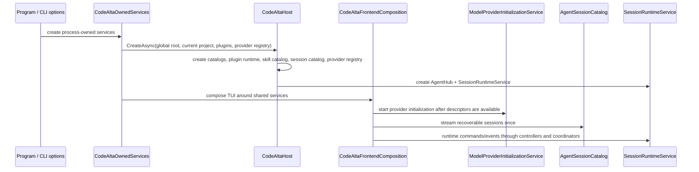
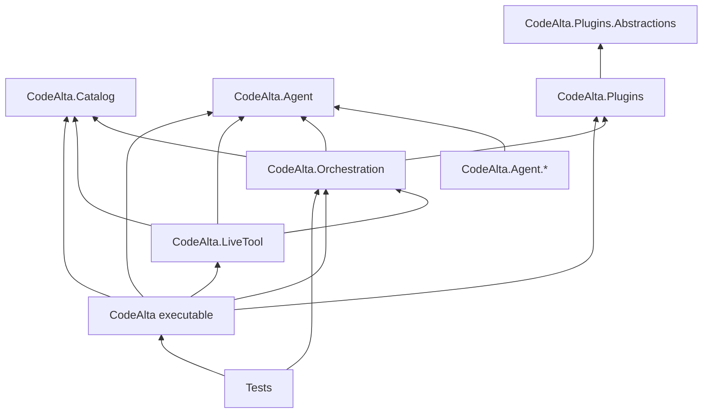
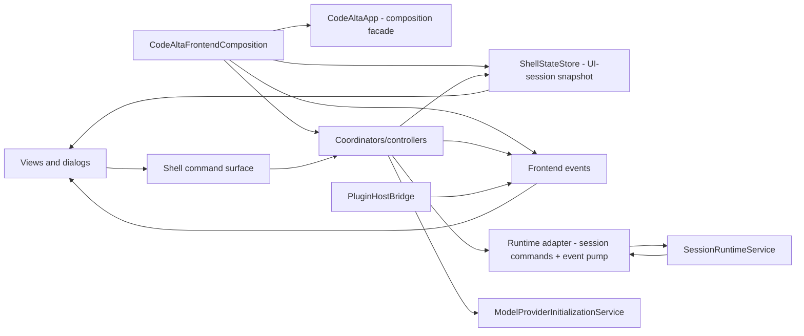
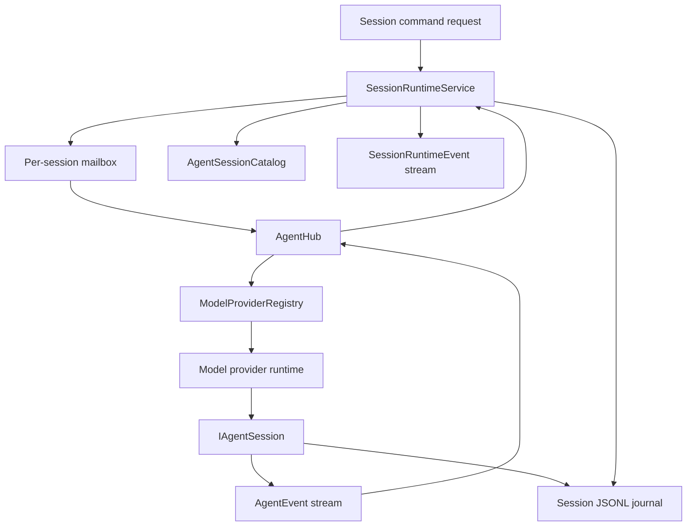

# Architecture overview

CodeAlta is organized as a terminal frontend on top of reusable runtime libraries. Read the code from process composition downward: owned process services, shared host composition, frontend composition, orchestration runtime, session catalog, model providers, and extension points.

## Startup and composition

`CodeAltaOwnedServices.CreateAsync` owns process concerns: the default `~/.alta` root, logging, model-catalog refresh, global config, and configured model-provider registration. It calls `CodeAltaHost.CreateAsync`, which composes reusable runtime services:

- `ProjectCatalog`, `SessionViewCatalog`, `AgentSessionCatalog`, and `SkillCatalog` from catalog/runtime stores;
- `PluginRuntimeManager` and plugin resource adapters;
- `ModelProviderRegistry`/`IModelProviderRegistry` and `IModelProviderInitializationService`;
- `AgentHub` and `SessionRuntimeService`;
- `ProjectFileSearchService` for prompt attachments and file pickers.

The TUI receives these services instead of constructing runtime primitives directly. Headless and tool-driven paths can reuse `CodeAltaHost` without terminal controls. Provider initialization and session catalog loading are independent startup tracks: providers can still be probing while local sessions are visible, and session listing does not instantiate or query providers.

## Dependency direction

Important boundary rules:

- Reusable session orchestration belongs in `CodeAlta.Orchestration`, not in `src/CodeAlta` views or dialogs.
- `CodeAlta.Orchestration` is headless and references `CodeAlta.Agent`, `CodeAlta.Catalog`, and `CodeAlta.Plugins` only.
- Views and dialogs render state and invoke command/service interfaces; they must not call `SessionRuntimeService`, `AgentHub`, provider registries, or plugin runtime services directly.
- Model providers own protocol adaptation, credentials, readiness, and model metadata. They do not own persisted session listing or project/session restore.
- `IAgentSessionStore`/`AgentSessionCatalog` own provider-independent persisted session listing, history reads, and deletion for one configured sessions root.
- `CodeAlta.Plugins.Abstractions` is the public plugin authoring surface. Runtime adapters belong in `CodeAlta.Plugins` or `CodeAlta.Orchestration`, not in the TUI. Plugins may contribute prompt parts, tools, resources, UI projections, and `alta` commands; they do not contribute independent session-owning provider runtimes.
- Public/runtime APIs expose ids, request/response records, snapshots, handles, and events. Internal mailbox actors stay internal.

`src/CodeAlta.Tests/ArchitectureGuardrailTests.cs` enforces several of these boundaries, including frontend/runtime separation, bounded runtime event streams, no broad UI callback regressions, and documentation of actor-style runtime ownership.

## Frontend shell

The terminal frontend is composed around narrow state, command, event, and projection seams.

Key frontend pieces:

- `CodeAltaApp` is the TUI composition facade and compatibility surface for existing view integration. New behavior should move into command handlers, coordinators, presenters, or adapters when doing so shortens call paths.
- `CodeAltaFrontendComposition.Create` wires view models, `ShellStateStore`, frontend events, model-provider state, shell controllers, prompt/session coordinators, project-file search, plugin bridges, and the `alta` dispatcher.
- `CodeAltaShellController` owns startup catalog loading, project/session open operations, recoverable-session discovery, and runtime-event queuing/draining. Runtime-event mutations are marshalled through `IUiDispatcher`.
- `ShellStateStore` is an immutable UI-session-owned projection snapshot for selection, tabs, and prompt sessions. It is not the owner of all runtime state.
- `RuntimeEventPump` is the frontend consumer of the orchestration runtime event stream and projects events into the shell controller.
- The command palette, slash commands, key bindings, and command bar are backed by shared shell command metadata and dispatch paths.

UI code awaits normally on the UI path. Background work must marshal back through the UI dispatcher before touching bindable state or controls.

## Runtime services

`SessionRuntimeService` is the central session runtime service. It owns coordinator sessions, recoverable-session projection, runtime events, prompt send/queue/steer/abort/compact flow, activation of CodeAlta-managed skills, and legacy session-view metadata persisted in local session journals.

`AgentHub` is the active CodeAlta agent/session facade. It resolves provider runtimes through `IModelProviderRegistry` when creating or resuming a runnable session, then owns active session handles and per-session run coordination. It does not discover/list persisted sessions and does not probe model providers.

Same-session mutable orchestration state is serialized through internal mailbox actors and session coordinators. Different sessions can run concurrently. Locks around runtime maps must remain short and must not wrap provider calls, tool execution, compaction, or journal writes. Runtime events use bounded streams so slow readers do not create unbounded memory pressure.

## Agent and provider boundary

The `CodeAlta.Agent` contracts are split by responsibility:

- `IAgentSessionStore` and `IAgentSessionCatalog` list/read/delete CodeAlta-owned sessions from one configured sessions root.
- `IModelProviderRegistry`, `IModelProviderRuntime`, `IModelProviderTurnExecutor`, and `IModelProviderInitializationService` describe configured providers, readiness/model metadata, and turn execution.
- `IAgentSession` owns event streaming/subscription, send, steer, abort, compact, and history retrieval for an attached session.
- `AgentEvent` is a normalized polymorphic event model for content, activity, session updates, plans, interactions, permissions, user-input requests, and errors.
- `AgentToolDefinition` and `AgentToolSpec` define model-callable host tools with validated names and JSON schemas.

Provider-runtime compatibility surfaces now use model-provider names. Do not reintroduce `IAgentBackend`, `AgentBackendId`, or `AgentBackendFactory`; new user-facing docs and UI should say **model provider** and **session**, not backend-owned session.

Provider packages create model-provider runtimes and turn executors. The CodeAlta local session runtime (`CodeAltaAgentRuntime`/`LocalAgentSession`) replays journals, composes provider requests, executes turns, appends events, and can switch compatible providers by replaying canonical CodeAlta history.

## Extension integration

Extensions are trusted local code or files that the host explicitly discovers:

- Source plugins under `~/.alta/plugins/<package-id>/plugin.cs` and `<project>/.alta/plugins/<package-id>/plugin.cs` are built and loaded in-process by `CodeAlta.Plugins`.
- Built-in plugins are registered through the same plugin runtime. The statistics plugin contributes transient projections and an `alta` command root.
- Plugins can contribute prompt processors, system/developer prompt parts, tools, resources, UI elements, transient session/timeline projections, and `alta` command roots. Model-provider plugin contributions are deferred; plugins cannot list or own sessions independently.
- Skill roots come from project/user filesystem roots, built-ins, and plugin resource contributions. Discovery and activation are owned by `SkillCatalog` and `SessionRuntimeService`.
- The in-session `alta` live tool is an in-process command gateway built from core contributors plus plugin contributors.

Extensions do not own canonical transcript persistence. Plugin-derived timeline cards are transient projections replayed from canonical agent events.

## Session lifecycle at a glance

1. A user, plugin, or tool creates a global or project session.
2. `SessionRuntimeService` resolves the model provider, project roots, instructions, tools, and skill advertisements.
3. `AgentHub` starts or resumes the CodeAlta session with the selected provider runtime.
4. The session receives a prompt through `IAgentSession.SendAsync` or an accepted steering request through `SteerAsync` when supported.
5. Provider/tool events are normalized to `AgentEvent` values and projected to `SessionRuntimeEvent` values.
6. Local-runtime sessions append normalized events plus legacy session-view headers/state to the sharded JSONL journal.
7. The frontend event pump projects runtime events into tabs, timelines, sidebars, usage indicators, and plugin projections.
8. Idle sessions can drain one queued prompt, switch providers when the local-runtime history can be replayed safely, or compact when supported.

## Where to put new code

- UI controls, dialogs, view models, terminal presenters, and key-binding/slash-command adapters belong under `src/CodeAlta`.
- Runtime command/event contracts, session behavior, queue draining, skill activation, and plugin orchestration bridges belong under `src/CodeAlta.Orchestration`.
- Session catalog/store contracts, provider-neutral session/event contracts, model-provider contracts, and local raw-API mechanics belong under `src/CodeAlta.Agent`.
- Provider-specific protocol details belong under the matching `src/CodeAlta.Agent.*` package.
- Catalog/config/filesystem metadata belongs under `src/CodeAlta.Catalog`.
- In-session command gateway behavior belongs under `src/CodeAlta.LiveTool`.
- Public plugin authoring APIs belong under `src/CodeAlta.Plugins.Abstractions`; plugin runtime implementation belongs under `src/CodeAlta.Plugins`.
