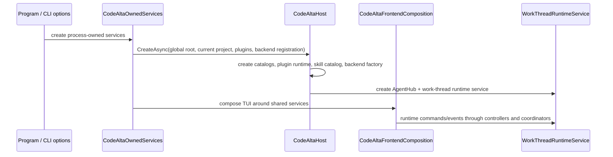
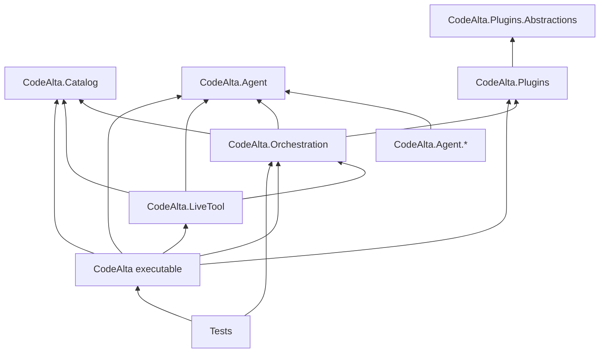
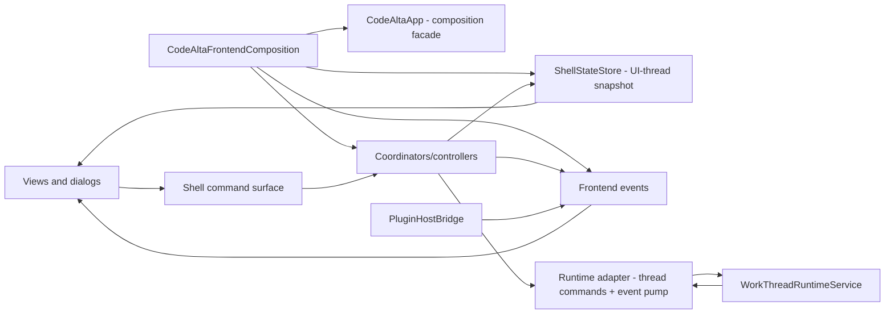
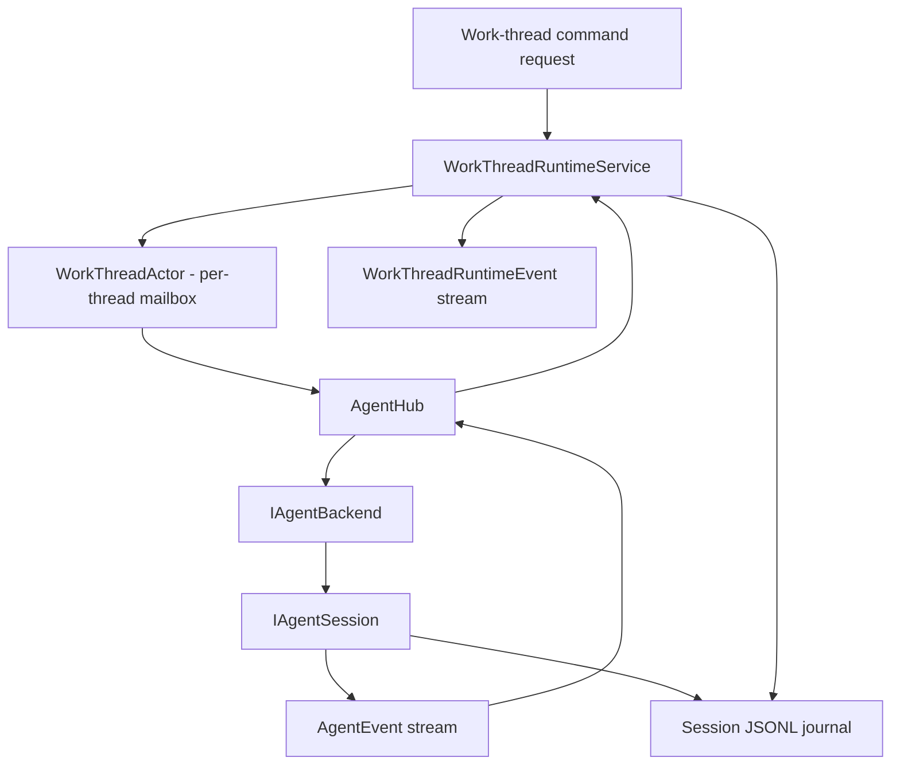

# Architecture overview

CodeAlta is organized as a terminal frontend on top of reusable runtime libraries. The code should be read from process composition downward: owned process services, shared host, frontend composition, orchestration runtime, agent backends, and extension points.

## Startup and composition

`CodeAltaOwnedServices.CreateAsync` owns process concerns: the default `~/.alta` root, logging, model-catalog refresh, global config, ACP install/config services, and provider backend registration. It calls `CodeAltaHost.CreateAsync`, which composes reusable runtime services:

- `ProjectCatalog`, `WorkThreadCatalog`, and `SkillCatalog` from `CodeAlta.Catalog`;
- `PluginRuntimeManager` and plugin resource/backend adapters;
- `AgentBackendFactory`, `AgentHub`, and `WorkThreadRuntimeService`;
- `ProjectFileSearchService` for prompt attachments and file pickers.

The TUI receives these services instead of constructing runtime primitives directly. Headless and tool-driven paths can reuse `CodeAltaHost` without terminal controls.

## Dependency direction

Important boundary rules:

- Reusable thread/session orchestration belongs in `CodeAlta.Orchestration`, not in `src/CodeAlta` views or dialogs.
- `CodeAlta.Orchestration` is headless and references `CodeAlta.Agent`, `CodeAlta.Catalog`, and `CodeAlta.Plugins` only.
- Views and dialogs render state and invoke command/service interfaces; they must not call `WorkThreadRuntimeService`, `AgentHub`, or plugin runtime services directly.
- `CodeAlta.Plugins.Abstractions` is the public plugin authoring surface. Runtime adapters belong in `CodeAlta.Plugins` or `CodeAlta.Orchestration`, not in the TUI.
- Public/runtime APIs expose ids, request/response records, snapshots, handles, and events. Internal mailbox actors stay internal.

`src/CodeAlta.Tests/ArchitectureGuardrailTests.cs` enforces several of these boundaries, including frontend/runtime separation, bounded runtime event streams, no broad UI callback regressions, and documentation of actor-style runtime ownership.

## Frontend shell

The terminal frontend is composed around narrow state, command, event, and projection seams.

Key frontend pieces:

- `CodeAltaApp` is the TUI composition facade and compatibility surface for existing view integration. New behavior should move into command handlers, coordinators, presenters, or adapters when doing so shortens call paths.
- `CodeAltaFrontendComposition.Create` wires view models, `ShellStateStore`, frontend events, model-provider state, shell controllers, prompt/thread coordinators, project-file search, plugin bridges, and the `alta` dispatcher.
- `CodeAltaShellController` owns startup catalog loading, project/thread open operations, recoverable-thread discovery, and runtime-event queuing/draining. Runtime-event mutations are marshalled through `IUiDispatcher`.
- `ShellStateStore` is an immutable UI-thread-owned projection snapshot for selection, tabs, and prompt sessions. It is not the owner of all runtime state.
- `RuntimeEventPump` is the frontend consumer of the orchestration runtime event stream and projects events into the shell controller.
- The command palette, slash commands, key bindings, and command bar are backed by shared shell command metadata and dispatch paths.

UI code awaits normally on the UI path. Background work must marshal back through the UI dispatcher before touching bindable state or controls.

## Runtime services

`WorkThreadRuntimeService` is the central work-thread runtime. It owns coordinator sessions, recoverable threads, runtime events, prompt send/queue/steer/abort/compact flow, activation of CodeAlta-managed skills, and CodeAlta thread metadata persisted in local session journals.

`AgentHub` is the runtime cache and facade for backend/session objects. It starts backends lazily, registers agents, lists models/sessions, resumes sessions, and normalizes session metadata. The hub shields orchestration from provider package details.

Same-thread mutable orchestration state is serialized through internal mailbox actors. Different threads can run concurrently, but commands for one thread are ordered by that thread's actor. Runtime events use bounded streams so slow readers do not create unbounded memory pressure.

## Agent boundary

The `CodeAlta.Agent` contract is intentionally small:

- `IAgentBackend` owns backend lifecycle, model/session listing, create/resume, and best-effort delete.
- `IAgentSession` owns event streaming/subscription, send, steer, abort, compact, and history retrieval.
- `AgentEvent` is a normalized polymorphic event model for content, activity, session updates, plans, interactions, permissions, user-input requests, and errors.
- `AgentToolDefinition` and `AgentToolSpec` define model-callable host tools with validated names and JSON schemas.

Local raw-API providers are implemented by wrapping provider-specific turn executors in `LocalAgentBackend`/`LocalAgentSession`. ACP and other backend packages implement the same contract.

## Extension integration

Extensions are trusted local code or files that the host explicitly discovers:

- Source plugins under `~/.alta/plugins/<package-id>/plugin.cs` and `<project>/.alta/plugins/<package-id>/plugin.cs` are built and loaded in-process by `CodeAlta.Plugins`.
- Built-in plugins are registered through the same plugin runtime. The statistics plugin contributes transient projections and an `alta` command root.
- Plugins can contribute prompt processors, system/developer prompt parts, tools, provider factories, resource roots, UI elements, transient thread projections, and `alta` command roots.
- Skill roots come from project/user filesystem roots, built-ins, and plugin resource contributions. Discovery and activation are owned by `SkillCatalog` and `WorkThreadRuntimeService`.
- The in-session `alta` live tool is an in-process command gateway built from core contributors plus plugin contributors.

Extensions do not own canonical transcript persistence. Plugin-derived thread cards are transient projections replayed from canonical agent events.

## Thread lifecycle at a glance

1. A user or tool creates a global or project thread.
2. `WorkThreadRuntimeService` resolves the model provider, project roots, instructions, tools, and skill advertisements.
3. `AgentHub` starts or resumes the selected backend/session.
4. The session receives a prompt through `IAgentSession.SendAsync` or an accepted steering request through `SteerAsync` when supported.
5. Provider/tool events are normalized to `AgentEvent` values and projected to `WorkThreadRuntimeEvent` values.
6. Local-runtime sessions append normalized events plus CodeAlta thread headers/state to the sharded JSONL journal.
7. The frontend event pump projects runtime events into tabs, timelines, sidebars, usage indicators, and plugin projections.
8. Idle threads can drain one queued prompt, switch providers when the local-runtime history can be replayed safely, or compact when supported.

## Where to put new code

- UI controls, dialogs, view models, terminal presenters, and key-binding/slash-command adapters belong under `src/CodeAlta`.
- Runtime command/event contracts, work-thread behavior, queue draining, skill activation, and plugin orchestration bridges belong under `src/CodeAlta.Orchestration`.
- Provider-neutral backend/session/event contracts and local raw-API mechanics belong under `src/CodeAlta.Agent`.
- Provider-specific protocol details belong under the matching `src/CodeAlta.Agent.*` package.
- Catalog/config/filesystem metadata belongs under `src/CodeAlta.Catalog`.
- In-session command gateway behavior belongs under `src/CodeAlta.LiveTool`.
- Public plugin authoring APIs belong under `src/CodeAlta.Plugins.Abstractions`; plugin runtime implementation belongs under `src/CodeAlta.Plugins`.
