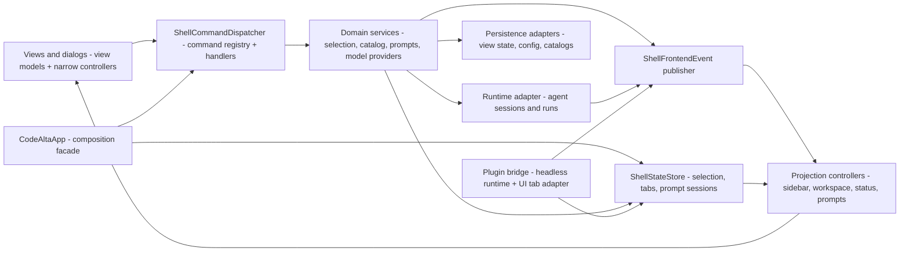

# Development Guide

Repository-wide development rules that should be enforced consistently belong here.

Add a rule here when it is important enough that contributors and agents should reliably follow it. Do not use this document for temporary plans or one-off design notes.

## Async And UI Threading

- Frontend UI flow defaults to plain `await`.
- Do not use `ConfigureAwait(false)` in UI code or UI callbacks when the continuation reads or mutates bindable state, view models, controls, presentation state, or frontend coordinator state.
- `ConfigureAwait(false)` is allowed in explicit background or infrastructure code such as libraries, SDKs, transport, persistence, filesystem I/O, pumps, workers, and startup code that marshals back before touching UI-owned state.
- When code leaves the UI flow for background work, keep the boundary explicit and narrow.
- If background work needs to update UI-owned state afterward, marshal back to the UI dispatcher first.
- Do not introduce workaround abstractions only to compensate for incorrect frontend `ConfigureAwait(false)` usage.

## Architecture Boundaries

- Keep reusable agent/session/thread orchestration out of the `CodeAlta` frontend project. Frontend code should own terminal controls, view models, visual projections, dialogs, and adapters from user actions to application/runtime commands.
- Keep `CodeAlta.Orchestration`, `CodeAlta.Orchestration.Hosting`, `CodeAlta.Plugins`, and `CodeAlta.Catalog` independent from the TUI project and terminal UI controls.
- Keep plugin orchestration hooks headless. Frontend code may render plugin-derived projections or adapt plugin UI/tab services, but should not own agent event observer dispatch or derived-event creation.
- Treat plugin-derived thread events as transient projections. Do not persist them as canonical user/agent transcript events unless a future decision explicitly changes the event model.
- Prefer named ports, request/response DTOs, immutable snapshots, and event streams over large callback aggregates or callback-wrapper context classes.
- New shell/application contracts should use `ModelProvider` terminology for selectable LLM runtime and endpoint configuration. Keep `Backend` names for low-level runtime adapters such as `IAgentBackend`.

## Frontend Shell Shape

The TUI frontend should stay organized around explicit state, commands, events, and projections rather than broad callbacks into `CodeAltaApp`:

- `CodeAltaApp` is the TUI shell composition root and compatibility facade. `ShellFrontendHost` is only the run/tick/dispose lifecycle wrapper; do not treat it as the owner of frontend service composition.
- Guardrails should prevent `CodeAltaApp` from becoming a broad callback target again: new behavior belongs in named command services, domain coordinators, events, projection controllers, or explicit adapters.
- Remaining `CodeAltaApp` internal methods are grouped by owner: composition/lifecycle wiring; provider and prompt services; projection/status/focus adapters; catalog/selection/thread restore coordinators; and tab/file/dialog command routing. Move a method only when doing so deletes callbacks/adapters or shortens an existing call path.
- Views and dialogs receive view models plus command/service interfaces; they should not receive long domain callback lists.
- Selection, catalog, tab, prompt, model-provider, runtime, persistence, and plugin changes should either publish a typed frontend event or return a typed command/use-case result that a small application service projects.
- The command palette, command bar, slash commands, and shortcuts should share the same shell command metadata and dispatcher path.
- Logical draft, thread, editor, and plugin tabs should be inspectable through a single shell tab state/service model even when a visual toolkit requires cached tab-page instances.

## Runtime Orchestration Concurrency

- Runtime thread/session state should have a clear single writer. Prefer per-thread mailbox/actor-style command processors for mutable orchestration state instead of scattered locks, callback mutation, and frontend-owned workarounds.
- Actor-style orchestration is an internal implementation pattern: public APIs should expose thread/run ids, request DTOs, snapshots, handles, and events, not actor references, actor paths, or mailbox channels.
- Async completions, backend/session callbacks, and plugin observer results must be converted into runtime commands/events before they mutate mailbox-owned state.
- Use bounded queues or documented overflow/coalescing policies for runtime and plugin event streams.
- Do not add Akka.NET or another actor framework as a default dependency. A framework dependency requires a separate decision record/spike showing that it simplifies supervision, testing, shutdown, and host integration compared with the internal mailbox pattern.

## State And Mutability

- Do not add static mutable data anywhere in the codebase. Prefer instance-owned state, DI-managed services, immutable static data, frozen collections, or generated constants.
- Runtime/session state should be owned by explicit services or mailbox actors. Avoid process-wide lock maps and static caches for runtime/session ownership.
- Persist user-owned state only through the catalog/runtime stores that own that data. Do not write config, session journals, prompt drafts, plugin state, or UI state from unrelated layers.
- Treat logs, traces, journals, prompts, command output, provider payloads, and plugin diagnostics as potentially sensitive user data.

## Public APIs

- Public APIs require XML documentation and should document thrown exceptions.
- Validate inputs early with specific exceptions. Use `ArgumentNullException.ThrowIfNull()` and `ArgumentException.ThrowIfNullOrWhiteSpace()` where appropriate.
- Keep APIs small and hard to misuse. Prefer named request/response records over positional parameter lists when a boundary is likely to evolve.
- Preserve nullable annotations. Do not suppress warnings without a justification comment.

## Documentation

- If a repository-wide development rule should be enforced, add or update it here.
- Keep `AGENTS.md` aligned with this document when agent-facing instructions depend on it.
- Update public docs, internal docs, and website pages when behavior changes.
- Internal docs must describe current implementation. Move completed plans or superseded drafts out of tracked docs rather than leaving them as active references.
- Keep `doc/readme.md` as the top-down navigation entry point and link detailed implementation docs from it.
