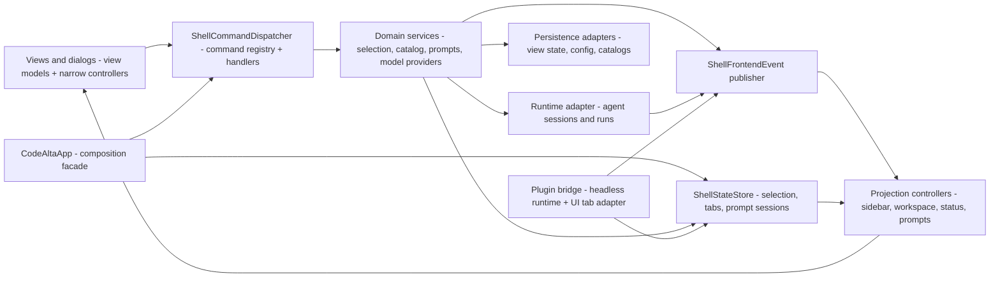

# Development Guide

Repository-wide development rules that should be enforced consistently belong here.

Add a rule here when it is important enough that contributors and agents should reliably follow it. Do not use this document for temporary plans or one-off design notes.

## Async And UI Threading

- Frontend UI flow defaults to plain `await`.
- Do not use `ConfigureAwait(false)` in UI code or UI callbacks when the continuation reads or mutates bindable state, view models, controls, presentation state, or frontend coordinator state.
- `ConfigureAwait(false)` is allowed in explicit background or infrastructure code such as libraries, SDKs, transport, persistence, filesystem I/O, pumps, workers, and startup code that marshals back before touching UI-owned state.
- When code leaves the UI flow for background work, keep the boundary explicit and narrow.
- If background work needs to update UI-owned state afterward, marshal back to the UI dispatcher first.
- Do not introduce workaround abstractions only to compensate for incorrect frontend `ConfigureAwait(false)` usage.

## Architecture Boundaries

- Keep reusable agent/session orchestration out of the `CodeAlta` frontend project. Frontend code should own terminal controls, view models, visual projections, dialogs, and adapters from user actions to application/runtime commands.
- Keep `CodeAlta.Orchestration`, `CodeAlta.Orchestration.Hosting`, `CodeAlta.Plugins`, and `CodeAlta.Catalog` independent from the TUI project and terminal UI controls.
- Keep plugin orchestration hooks headless. Frontend code may render plugin-derived projections or adapt plugin UI/tab services, but should not own agent event observer dispatch or derived-event creation.
- Keep plugin prompt/notification abstractions minimal data contracts. Do not reproduce `XenoAtom.Terminal.UI` toast or control APIs in plugin abstractions; terminal controls and dialogs stay owned by the frontend.
- Treat plugin-derived session/timeline events as transient projections. Do not persist them as canonical user/agent transcript events unless a future decision explicitly changes the event model.
- Prefer named ports, request/response DTOs, immutable snapshots, and event streams over large callback aggregates or callback-wrapper context classes.
- New shell/application contracts should use `ModelProvider` terminology for selectable LLM runtime and endpoint configuration. Do not introduce new `Backend` names for provider/session ownership; keep remaining backend strings limited to explicit compatibility wire/config names or real third-party terminal/backend concepts.

### Agent runtime, sessions, and model providers

The current provider/session split is intentional and should be preserved:

- `AgentHub` is the in-process active-session facade. It owns active session handles, per-session run coordination, abort/steer/compact flow, and provider resolution for start/resume/run. It must not own persisted session discovery or model-provider probing.
- `SessionRuntimeService` is the headless orchestration service that maps UI/live-tool session actions to runtime requests, prompt queues, skill activation, session history, and `SessionRuntimeEvent` projections.
- `IAgentSessionStore` and `IAgentSessionCatalog` are the durable session owners. Session listing, metadata reads, history reads, and deletion are provider-independent and scan one configured sessions root for the current runtime. Keep the listing surface streaming-only through `IAsyncEnumerable<AgentSessionMetadata> ListSessionsAsync(...)`; callers that need a list can materialize at the edge.
- Model providers own configured provider identity, protocol adaptation, readiness, capabilities, and model catalogs only. `IModelProviderRegistry` and `IModelProviderInitializationService` initialize/probe providers independently and must not gate local session listing, session history loading, or project import.
- Provider initialization starts eagerly after provider descriptors/configuration are available and runs concurrently with session catalog listing and pending-session restore. A slow or failing provider must become a provider state, not an application startup failure.
- Active sessions must remain independently scheduled. Use per-session ownership/serialization for mutable runtime state and event append ordering; do not add a process-wide run lock, event-writer lock, or provider/session deduplication layer.
- Parent/sub-session relationships are lineage/orchestration metadata only. Do not make child sessions share the parent's run gate, cancellation token, provider continuation state, or journal writer after creation.
- Conversation-like orchestration and UI concepts should use `Session` or `SessionView` naming. Keep `Thread` only for actual OS/runtime threading, framework terms, or explicit tolerant readers/legacy view-state APIs that still load old session-view data.
- Removed `AgentBackendId`, `BackendId`, `IAgentBackend`, and `AgentBackendFactory` symbols must not be reintroduced. Use `ModelProviderId`, `ModelProviderDescriptor`, `IModelProviderRegistry`, and `IModelProviderRuntime` for selectable providers.
- Avoid `LocalAgentBackend` and new broad `Local*` names for runtime/session ownership. The CodeAlta-owned runtime is `CodeAltaAgentRuntime`/`AgentHub`; provider-specific raw API pieces may still use `LocalAgent*` when they describe the local replay/journal implementation.
- Compatibility constraints are user data and configuration only: existing session journals and legacy session-view view state must remain loadable with tolerant reads of legacy `BackendId`/`SessionId`/provider fields, and existing provider `config.toml` / `[providers]` semantics must stay stable unless a focused migrator is added.

Existing guardrail coverage to keep intact when touching startup/session boundaries:

- `src/CodeAlta.Tests/AgentSessionCatalogTests.cs` covers concurrent callers sharing one catalog load, cached streaming snapshots, corrupt-file tolerance, and provider-independent listing for missing/disabled providers.
- `src/CodeAlta.Tests/CodeAltaShellControllerTests.cs` covers sessions becoming visible before provider initialization completes, provider initialization starting before slow session scans complete, and complete startup catalog loading through one recoverable session stream.
- `src/CodeAlta.Tests/ModelProviderInitializationServiceTests.cs` covers per-provider failure/timeout isolation and model-list caching/reuse.
- `src/CodeAlta.Orchestration.Tests/AgentHubTests.cs`, `src/CodeAlta.Tests/LocalAgentSessionJournalFileTests.cs`, and `src/CodeAlta.Orchestration.Tests/SessionRuntimeStressTests.cs` cover per-session runtime coordination and journal/concurrency behavior.

## Frontend Shell Shape

The TUI frontend should stay organized around explicit state, commands, events, and projections rather than broad callbacks into `CodeAltaApp`:

- `CodeAltaApp` is the TUI shell composition root and compatibility facade. `ShellFrontendHost` is only the run/tick/dispose lifecycle wrapper; do not treat it as the owner of frontend service composition.
- Guardrails should prevent `CodeAltaApp` from becoming a broad callback target again: new behavior belongs in named command services, domain coordinators, events, projection controllers, or explicit adapters.
- Remaining `CodeAltaApp` internal methods are grouped by owner: composition/lifecycle wiring; provider and prompt services; projection/status/focus adapters; catalog/selection/session restore coordinators; and tab/file/dialog command routing. Move a method only when doing so deletes callbacks/adapters or shortens an existing call path.
- Views and dialogs receive view models plus command/service interfaces; they should not receive long domain callback lists.
- Selection, catalog, tab, prompt, model-provider, runtime, persistence, and plugin changes should either publish a typed frontend event or return a typed command/use-case result that a small application service projects.
- The command palette, command bar, slash commands, and shortcuts should share the same shell command metadata and dispatcher path.
- Logical draft, session, editor, and plugin tabs should be inspectable through a single shell tab state/service model even when a visual toolkit requires cached tab-page instances.

## Runtime Orchestration Concurrency

- Runtime session state should have a clear single writer. Prefer per-session mailbox/actor-style command processors for mutable orchestration state instead of scattered locks, callback mutation, and frontend-owned workarounds.
- Actor-style orchestration is an internal implementation pattern: public APIs should expose session/run ids, request DTOs, snapshots, handles, and events, not actor references, actor paths, or mailbox channels.
- Async completions, provider/session callbacks, and plugin observer results must be converted into runtime commands/events before they mutate mailbox-owned state.
- Use bounded queues or documented overflow/coalescing policies for runtime and plugin event streams.
- Do not add Akka.NET or another actor framework as a default dependency. A framework dependency requires a separate decision record/spike showing that it simplifies supervision, testing, shutdown, and host integration compared with the internal mailbox pattern.

## State And Mutability

- Do not add static mutable data anywhere in the codebase. Prefer instance-owned state, DI-managed services, immutable static data, frozen collections, or generated constants.
- Runtime/session state should be owned by explicit services or mailbox actors. Avoid process-wide lock maps and static caches for runtime/session ownership.
- Persist user-owned state only through the catalog/runtime stores that own that data. Do not write config, session journals, prompt drafts, plugin state, or UI state from unrelated layers.
- Treat logs, traces, journals, prompts, command output, provider payloads, and plugin diagnostics as potentially sensitive user data.

## Provider Defaults And Compatibility

- Provider-specific request defaults, compatibility profiles, and header/body defaults should live in the copied provider-defaults content file unless they require code-backed message transformation or SDK integration.
- Keep `config.toml` backward compatible: existing `extra_body`, `profile`, `compaction`, and `model_overrides` semantics remain authoritative over built-in defaults.
- Do not add script-like provider transforms to config. Complex message restructuring must stay in code behind narrow, named compatibility flags.

## Public APIs

- Public APIs require XML documentation and should document thrown exceptions.
- Validate inputs early with specific exceptions. Use `ArgumentNullException.ThrowIfNull()` and `ArgumentException.ThrowIfNullOrWhiteSpace()` where appropriate.
- Keep APIs small and hard to misuse. Prefer named request/response records over positional parameter lists when a boundary is likely to evolve.
- Preserve nullable annotations. Do not suppress warnings without a justification comment.

## Documentation

- If a repository-wide development rule should be enforced, add or update it here.
- Keep `AGENTS.md` aligned with this document when agent-facing instructions depend on it.
- Update public docs, internal docs, and website pages when behavior changes.
- Internal docs must describe current implementation. Move completed plans or superseded drafts out of tracked docs rather than leaving them as active references.
- Keep `doc/readme.md` as the top-down navigation entry point and link detailed implementation docs from it.
