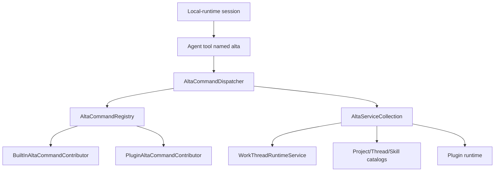

# `alta` live tool

`alta` is an in-process command gateway exposed to CodeAlta-managed sessions and trusted plugins. It is not a separate daemon and it does not keep command streams open. Each invocation builds a fresh command tree, runs one command, and returns help text or a finite JSONL transcript.

## Architecture



Core types:

- `AltaSessionToolFactory` creates the agent tool named `alta` with `args`, optional `stdin`, `cwd`, output caps, and timeout.
- `AltaCommandRegistry` creates a fresh `XenoAtom.CommandLine.CommandApp` per invocation and merges built-in plus plugin command contributors.
- `AltaCommandDispatcher` captures stdout/stderr and flattens non-help results for live-tool consumption.
- `BuiltInAltaCommandContributor` contributes core `project`, `session`, `skill`, `provider`, `model`, `plugin`, `tool`, and `version` commands.
- `PluginAltaCommandContributor` adapts trusted plugin command roots while reserving core roots.

`CodeAltaFrontendComposition` wires the registry, dispatcher, service collection, plugin catalog bridge, and coordinator help text used by managed sessions.

## Tool input

The tool accepts CLI-style arguments excluding the executable name:

```json
{
  "args": ["session", "status", "<thread-id>"],
  "stdin": null,
  "cwd": null,
  "maxOutputRecords": 50,
  "maxOutputBytes": 20000,
  "timeoutMs": 5000
}
```

Rules:

- `args` is required and must contain at least one string.
- `stdin` is used only by commands that explicitly accept `--stdin`.
- `cwd` is used for project-relative command resolution when supplied.
- output caps and timeout are optional positive integers; omit them unless a bound is needed.
- explicit JSON `null` for optional fields is treated like omission.

## Output contract

Help invocations return plain text:

```text
alta --help
alta session send --help
```

Non-help invocations return compact JSONL headed by an `alta.result` record. Handlers emit flat records that are intended to remain bounded and easy to parse. Commands that submit work return submission/queue metadata instead of waiting for a model run to finish.

Use `--detailed` only when per-item metadata is needed. Discovery commands default to compact aggregate records such as refs, keys, paths, or capability lists.

## Built-in command groups

| Group | Purpose |
| --- | --- |
| `version` | Report host/live-tool version metadata. |
| `project` | List, show, resolve, upsert, and inspect current project context. |
| `session` | List, create, show, send, queue, steer, abort, compact, inspect, report, and coordinate work threads. |
| `skill` | List, show, and activate CodeAlta-managed skills. |
| `tool` | Inspect live-tool status and command capabilities. |
| `provider` | List configured providers and provider model refs. |
| `model` | List, show, and resolve model refs. |
| `plugin` | Inspect active plugin runtime state. |

`skills activate` and `skills_activate` are compatibility aliases for `skill activate`. Prefer the singular `skill` group in new prompts and docs.

## Common discovery commands

```text
alta --help
alta tool status
alta tool capability list
alta project current
alta project list
alta provider list
alta model list --provider <provider-key>
alta skill list --project <project>
alta plugin list
```

Most list commands support compact defaults plus a `--detailed` mode.

## Session commands

Useful read commands:

```text
alta session list --project <project> --state all --limit 20
alta session show <thread-id>
alta session status <thread-id>
alta session children <thread-id> --recursive
alta session model <thread-id>
alta session result <thread-id>
alta session metrics <thread-id> --scope last-turn
alta session tail <thread-id> --last 10
alta session events <thread-id> --kind assistant.message --fields timestamp,kind,text
```

Useful control commands:

```text
alta session create --project <project> --title "Investigate parser"
alta session create --project <project> --same-model-as <thread-id>
alta session send <thread-id> --message "Summarize the latest failure."
alta session send <thread-id> --stdin --queue-if-busy
alta session queue <thread-id> --message "Run this after the current turn."
alta session steer <thread-id> --message "Focus on the smallest fix."
alta session abort <thread-id> --reason "Superseded"
alta session compact <thread-id>
```

Control commands acknowledge submission. They do not block until the target model finishes. If a session is busy, `send --queue-if-busy` and `session queue` persist queue items with caller attribution; the runtime drains at most one queued prompt when that thread becomes idle.

## Delegated work and peer messages

Agent-originated delegated work is designed to yield after submission. Parented session creation/send paths include metadata such as `notificationExpected`, `shouldPoll`, `shouldYield`, and `nextStep` so a coordinator can stop active waiting and let CodeAlta forward the child final reply or error back to the parent thread.

Use normal `session send` for actionable prompts that should make the target model run. Use message/request commands for coordination notes that should be attributed as delegated-agent traffic instead of user/developer/system instructions:

```text
alta session message <thread-id> --kind handoff --message "Context collected."
alta session request <thread-id> --reply-requested --stdin
```

Polling commands such as `status`, `tail`, and `events` are for diagnostics, explicit observation, or cases where no parent notification is expected.

## Provider and model discovery

Provider/model refs are deterministic and id-based:

```text
alta provider list
alta provider list --detailed
alta provider model list --provider <provider-key>
alta model list --provider <provider-key> --reasoning high
alta model show --model-ref <provider-key>:<model-id>@high
alta model resolve --model-ref <provider-key>:<model-id>@high
```

`model show` and `model resolve` validate exact refs when model metadata is available and report requested/effective reasoning so callers can see whether reasoning was applied, defaulted, or unsupported.

## Skill commands

```text
alta skill list --project <project>
alta skill list --project <project> --detailed
alta skill show <skill-name>
alta skill activate <skill-name> --session <thread-id>
```

Activation uses the same runtime path as the UI. It succeeds only when CodeAlta can inject skill context into the target local-runtime session; provider-managed native skill sessions return an unsupported-capability diagnostic.

## Plugin command roots

Plugins add live-tool commands by returning `PluginAltaCommandContribution` records from `PluginBase.GetAltaCommands()`. Each contribution declares a root/path, policy flags, ordering, and a factory that creates a fresh unattached `XenoAtom.CommandLine.CommandNode`.

The host reserves these root commands: `version`, `project`, `session`, `skill`, `skills`, `skills_activate`, `provider`, `model`, `plugin`, and `tool`. Plugin roots that collide with a reserved or earlier plugin root are skipped and diagnosed by the plugin runtime.

Plugin command policy flags describe whether a command mutates state, is disruptive, requires the in-process runtime, or supports catalog-only context. Mutating plugin-originated commands include plugin provenance for audit and timeline reconstruction.

Plugins can also call built-in commands through `Services.Alta.InvokeAsync(...)` without referencing `CodeAlta.LiveTool`. Project-scoped plugin invocations inherit their project scope and working directory unless overridden by the runtime rules.

## Capability policy

`alta tool capability list` summarizes command policy metadata. Command policies are advisory and host-enforced where applicable:

- read-only vs mutating;
- disruptive operations such as abort;
- requires in-process runtime vs catalog-only context;
- plugin provenance for plugin-contributed or plugin-invoked commands.

The command gateway is available only to CodeAlta-managed sessions whose configured backend id supports host-injected tools.
