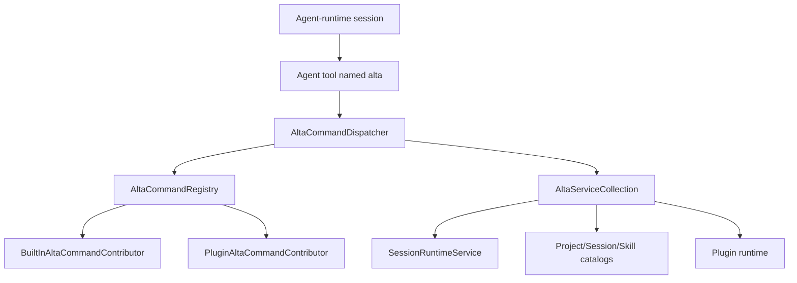

# `alta` live tool

`alta` is an in-process command gateway exposed to CodeAlta-managed sessions and trusted plugins. It is not a separate daemon and it does not keep command streams open. Each invocation builds a fresh command tree, runs one command, and returns help text or a finite JSONL transcript.

## Architecture



Core types:

- `AltaSessionToolFactory` creates the agent tool named `alta` with `args`, optional `stdin`, `cwd`, output caps, and timeout.
- `AltaCommandRegistry` creates a fresh `XenoAtom.CommandLine.CommandApp` per invocation and merges built-in plus plugin command contributors.
- `AltaCommandDispatcher` captures stdout/stderr and flattens non-help results for live-tool consumption.
- `BuiltInAltaCommandContributor` contributes core `project`, `session`, `skill`, `provider`, `model`, `plugin`, `tool`, and `version` commands.
- `PluginAltaCommandContributor` adapts trusted plugin command roots while reserving core roots.

`CodeAltaFrontendComposition` wires the registry, dispatcher, service collection, plugin catalog bridge, and coordinator help text used by managed sessions.

## Tool input

The tool accepts CLI-style arguments excluding the executable name:

```json
{
  "args": ["session", "status", "<session-id>"],
  "stdin": null,
  "cwd": null,
  "maxOutputRecords": 50,
  "maxOutputBytes": 20000,
  "timeoutMs": 5000
}
```

Rules:

- `args` is required and must contain at least one string.
- `stdin` is used only by commands that explicitly accept `--stdin`.
- `cwd` is used for project-relative command resolution when supplied.
- output caps and timeout are optional positive integers; omit them unless a bound is needed.
- explicit JSON `null` for optional fields is treated like omission.

## Output contract

Help invocations return plain text:

```text
alta --help
alta session send --help
```

Non-help invocations return compact JSONL headed by an `alta.result` record. Handlers emit flat records that are intended to remain bounded and easy to parse. Commands that submit work return submission/queue metadata instead of waiting for a model run to finish.

Use `--detailed` only when per-item metadata is needed. Discovery commands default to compact aggregate records such as refs, keys, paths, or capability lists.

## Built-in command groups

| Group | Purpose |
| --- | --- |
| `version` | Report host/live-tool version metadata. |
| `ask` | Queue structured user questions for the calling session and return yield guidance. |
| `notes` | Get, replace, or clear the active sticky Markdown notes shown in the sidebar. |
| `project` | List, show, resolve, upsert, and inspect current project context. |
| `session` | List, create, show, send, queue, steer, abort, compact, inspect, report, and coordinate sessions. |
| `reminder` | Schedule delayed prompt content for the current or another session, and list/delete reminders. |
| `skill` | List, show, and activate CodeAlta-managed skills. |
| `tool` | Inspect live-tool status and command capabilities. |
| `provider` | List configured providers and provider model refs. |
| `model` | List, show, and resolve model refs. |
| `plugin` | Inspect active plugin runtime state. |

`note` is a compatibility alias for `notes`. Prefer the plural `notes` group because it names the sidebar panel and the single sticky notes document. `skills activate` and `skills_activate` are compatibility aliases for `skill activate`. Prefer the singular `skill` group in new prompts and docs.

## Common discovery commands

```text
alta --help
alta tool status
alta tool capability list
alta notes get
alta project current
alta session current
alta project list
alta provider list
alta model list --provider <provider-key>
alta skill list --project <project>
alta plugin list
alta mcp status
alta mcp tool search
```

Most list commands support compact defaults plus a `--detailed` mode.

## Session commands

Useful read commands:

```text
alta session current
alta session list --project <project> --state all --limit 20
alta session show <session-id>
alta session status <session-id>
alta session children <session-id> --recursive
alta session model <session-id>
alta session result <session-id>
alta session metrics <session-id> --scope last-turn
alta session tail <session-id> --last 10
alta session events <session-id> --kind assistant.message --fields timestamp,kind,text
```

`alta session current` is the shortest way for an agent-invoked live-tool call to discover its own CodeAlta session id. It does not require a session catalog lookup; outside a caller with session context it returns a usage diagnostic.

Useful control commands:

```text
alta session create --project <project> --title "Investigate parser"
alta session create --project <project> --same-model-as <session-id>
alta session send <session-id> --message "Summarize the latest failure."
alta session send <session-id> --stdin --queue-if-busy
alta session queue <session-id> --message "Run this after the current turn."
alta session steer <session-id> --message "Focus on the smallest fix."
alta session abort <session-id> --reason "Superseded"
alta session compact <session-id>
```

Control commands acknowledge submission. They do not block until the target model finishes. If a session is busy, `send --queue-if-busy` and `session queue` persist queue items with caller attribution; the runtime drains at most one queued prompt when that session becomes idle.

## Ask command

Use `alta ask --stdin` when an agent needs structured user input before continuing. Agent callers default to their source session; CLI or plugin callers outside an agent session must pass `--session <session-id>`. The command requires the in-process runtime/frontend ask service and returns immediately after queueing. It does not wait for the user to answer.

```text
alta ask --stdin
alta ask --session <session-id> --stdin
```

Payloads are JSON objects. Keep strings concise and prefer `--stdin` so shell quoting does not corrupt the request:

```json
{
  "file": { "path": "src/CodeAlta/Views/SessionWorkspaceView.cs" },
  "questions": [
    {
      "title": "Plan",
      "question": "Does this implementation plan look correct?",
      "description": "Review the proposed approach before implementation starts.",
      "choices": [
        { "title": "Approve", "description": "Proceed with the plan as written." },
        { "title": "Revise", "description": "Ask the agent to adjust the plan first." }
      ],
      "freeform": {
        "title": "Additional instructions",
        "placeholder": "Optional notes or requested changes..."
      }
    }
  ]
}
```

Validation requires at least one question; each question requires a `title`, `question`, and at least one of `choices` or `freeform`. The command bounds question/choice counts and text lengths. If `file.path` is present it is resolved under the session workspace/project roots and rejected when it escapes those roots. CodeAlta replaces the session timeline with a file editor while the ask is open. Users can add line comments without changing the file (`Ctrl+K`), finish a comment (`Esc`), delete it (`Ctrl+D`), move between comments (`Ctrl+N` / `Ctrl+P`), clear comments (`Ctrl+L Ctrl+K`), switch between the file editor and questions (`Ctrl+G Ctrl+E` / `Ctrl+G Ctrl+N`), and optionally edit/save the file (`Ctrl+S`). Submitted answers include the file path and any validated line comments in Markdown; if the user saved file edits, the response notes that the file was modified and saved on disk.

Successful output is JSONL headed by `alta.result` followed by one `alta.ask.queued` record:

```json
{"type":"alta.ask.queued","version":1,"askId":"019...","sessionId":"...","queued":true,"shouldYield":true,"recommendedAction":"stop","activeWaitAllowed":false,"shouldPoll":false,"nextStep":"Do not call another tool or poll. Yield now and wait for the next user prompt containing the ask response."}
```

After receiving `alta.ask.queued`, an LLM should stop the turn: do not call another tool, sleep, poll, or inspect status while waiting. CodeAlta presents the ask when the target session is idle, collects answers in ask mode, and submits a normal user prompt back to the same session. The formatted prompt omits the ask id from user-visible Markdown; CodeAlta carries the optional ask id on the prompt/journal event for correlation.

## Notes

Use `alta notes` for short-lived sticky Markdown that should remain visible while an agent works, such as a checklist, plan status, or next actions. There is one active notes document per running CodeAlta frontend; it starts empty and is shown in the left sidebar below Navigator. The sidebar Notes panel renders Markdown in a scrollable view, wraps horizontally, offers a copy-to-Markdown button, and has a clear action.

```text
alta notes get
alta notes set --stdin
alta notes clear
```

`alta notes get` emits the current Markdown as `alta.notes.current`. `alta notes set` replaces the entire notes document with Markdown read from stdin and emits `alta.notes.updated`; `--stdin` is accepted for consistency with other text commands. `alta notes clear` sets the document back to empty. Prefer `notes` over the singular `note` alias in new prompts and documentation.

## Reminders

Use `alta reminder create` to schedule prompt content to be sent later while the current CodeAlta host process remains running. The target defaults to the calling agent's current session; use `--session <session-id>` or `--session-id <session-id>` to target another session. `--duration` is a positive number of seconds or a `TimeSpan` such as `00:05:00`. `--repeat` is the total number of firings and defaults to 1. Reminder delivery uses normal `session send --queue-if-busy` semantics so a busy target queues the reminder instead of dropping it.

The TUI also exposes the same reminder registry for the selected session through the prompt-bar clock button and `/reminder` (`Ctrl+G Ctrl+D`). From the dialog you can create/delete reminders and load a selected reminder message back into the editor to update it. Session and project navigator rows show a clock icon while matching reminders are active.

```text
alta reminder create --duration 60 --content "Check the build status."
alta reminder create --duration 300 --repeat 3 --session <session-id> --stdin
alta reminder list --all
alta reminder delete <reminder-id>
```

## Delegated work and peer messages

Agent-originated delegated work is designed to yield after submission. Parented session creation/send paths include metadata such as `notificationExpected`, `shouldPoll`, `shouldYield`, and `nextStep` so a coordinator can stop active waiting and let CodeAlta forward the child final reply or error back to the parent session.

Use normal `session send` for actionable prompts that should make the target model run. Use message/request commands for coordination notes that should be attributed as delegated-agent traffic instead of user/developer/system instructions:

```text
alta session message <session-id> --kind handoff --message "Context collected."
alta session request <session-id> --reply-requested --stdin
```

Polling commands such as `status`, `tail`, and `events` are for diagnostics, explicit observation, or cases where no parent notification is expected.

## Provider and model discovery

Provider/model refs are deterministic and id-based:

```text
alta provider list
alta provider list --detailed
alta provider model list --provider <provider-key>
alta model list --provider <provider-key> --reasoning high
alta model show --model-ref <provider-key>:<model-id>@high
alta model resolve --model-ref <provider-key>:<model-id>@high
```

`model show` and `model resolve` validate exact refs when model metadata is available and report requested/effective reasoning so callers can see whether reasoning was applied, defaulted, or unsupported.

## Skill commands

```text
alta skill list --project <project>
alta skill list --project <project> --detailed
alta skill show <skill-name>
alta skill activate <skill-name> --session <session-id>
```

Activation uses the same runtime path as the UI. It succeeds only when CodeAlta can inject skill context into the target agent-runtime session; provider-managed native skill sessions return an unsupported-capability diagnostic.

## Plugin command roots

Plugins add live-tool commands by returning `PluginAltaCommandContribution` records from `PluginBase.GetAltaCommands()`. Each contribution declares a root/path, policy flags, ordering, and a factory that creates a fresh unattached `XenoAtom.CommandLine.CommandNode`.

The host reserves these root commands: `version`, `project`, `session`, `skill`, `skills`, `skills_activate`, `provider`, `model`, `plugin`, and `tool`. Plugin roots that collide with a reserved or earlier plugin root are skipped and diagnosed by the plugin runtime.

Plugin command policy flags describe whether a command mutates state, is disruptive, requires the in-process runtime, or supports catalog-only context. Mutating plugin-originated commands include plugin provenance for audit and timeline reconstruction.

Plugins can also call built-in commands through `Services.Alta.InvokeAsync(...)` without referencing `CodeAlta.LiveTool`. Project-scoped plugin invocations inherit their project scope and working directory unless overridden by the runtime rules.

The built-in MCP plugin contributes the `mcp` root. Current shipped commands are:

```text
alta mcp list
alta mcp status
alta mcp config sources
alta mcp server add <server> --command <command>
alta mcp server add <server> --url https://example.test/mcp --header Key=Value
alta mcp server remove <server>
alta mcp server enable <server>
alta mcp server disable <server>
alta mcp tool search
alta mcp tool describe --server <server> --tool <raw-tool-name>
alta mcp tool call --server <server> --tool <raw-tool-name> --arguments {"key":"value"}
```

MCP config/list/status commands read fixed JSON config paths and report overlay/shadowing without connecting to servers. MCP server add/remove mutates JSON MCP config only; enable/disable mutates TOML policy only. MCP tool commands lazily connect to stdio and HTTP/SSE servers, apply policy filters, emit redacted diagnostics, and return raw server/tool names plus stable aliases such as `mcp__server__tool`. Direct policy-controlled MCP agent tools use those same aliases; agents can use `alta mcp tool ...` commands for discovery, diagnostics, and manual calls. See [MCP support](mcp.md).

## Capability policy

`alta tool capability list` summarizes command policy metadata. Command policies are advisory and host-enforced where applicable:

- read-only vs mutating;
- disruptive operations such as abort;
- requires in-process runtime vs catalog-only context;
- plugin provenance for plugin-contributed or plugin-invoked commands.

The command gateway is available only to CodeAlta-managed sessions whose configured provider id supports host-injected tools.
