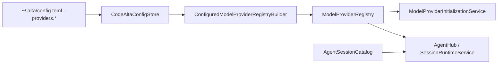
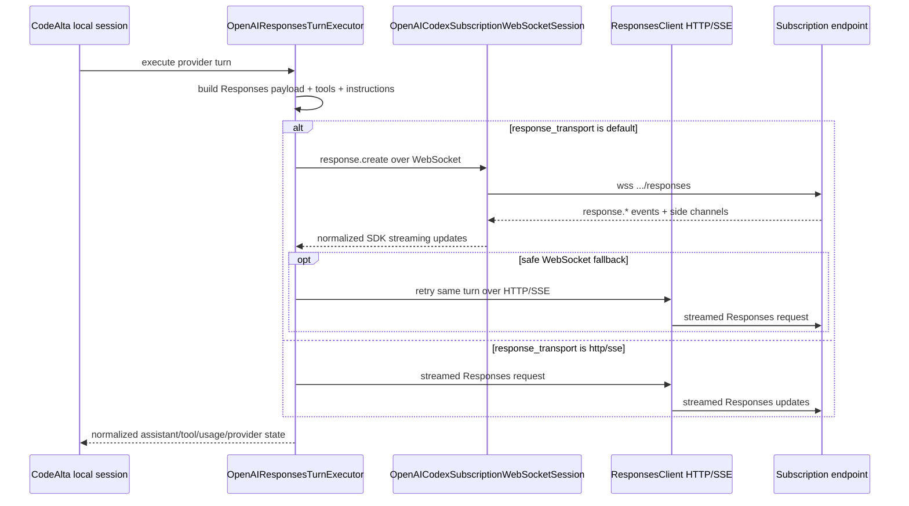

# Model providers

A model provider is the user-facing execution configuration for an LLM endpoint/runtime. Providers own credentials, protocol adaptation, readiness, model metadata, and turn execution. They do not own persisted CodeAlta sessions; sessions are listed and restored through the session catalog.

## Registration and initialization pipeline



At startup, `CodeAltaOwnedServices` loads provider definitions from `CodeAltaConfigStore` and builds `ModelProviderDescriptor` entries and provider runtime factories through `ConfiguredModelProviderRegistryBuilder`. `ModelProviderInitializationService` probes each provider independently and caches readiness/model information. Session listing uses `AgentSessionCatalog` against the single configured sessions root and runs independently of provider probing.

Providers that are disabled, invalid, or missing required credentials are skipped or marked unavailable without deleting their config entries.

## Config shape

Each provider is configured under `providers.<provider-key>`:

```toml
[chat]
default_provider = "work"

[providers.work]
enabled = true
display_name = "Work endpoint"
type = "openai-responses"
api_key_env = "WORK_ENDPOINT_API_KEY"
api_url = "https://api.example.test/v1"
network_timeout_seconds = 180
model = "model-id"
reasoning_effort = "high"
models_dev_provider_id = "openai"
models_include_regex = "model-id|model-next"

[providers.work.model_overrides.model-id]
context_window = 400000
output_token_limit = 128000
```

Important behavior:

- `enabled = false` prevents registration. Omitted `enabled` normalizes to `true` for user entries.
- `display_name` is optional; CodeAlta can derive a display name from the provider key.
- `model` and `reasoning_effort` are defaults, not a hard limit on model selection unless the provider is configured with `single_model_id`.
- `models_include_regex` is an optional .NET regular expression applied to discovered model ids. Omit it to expose every discovered/fallback model; use alternation such as `model1|model2` or patterns such as `model\d+` to keep a smaller catalog.
- `api_key` stores a literal secret; `api_key_env` points to an environment variable. Prefer environment variables for shared machines.
- `api_url`, `network_timeout_seconds`, organization/project fields, provider-specific auth fields, `extra_body`, `profile`, `compaction`, `models_dev_provider_id`, `models_include_regex`, and `model_overrides` are preserved by the advanced TOML editor.
- `network_timeout_seconds` sets the OpenAI/Azure SDK network timeout for `openai-chat`, `openai-responses`, `azure-openai`, and `codex` providers. Leave it unset to use the OpenAI SDK default timeout of 100 seconds.
- The bundled template disables all built-ins explicitly. Users opt in by enabling/configuring a provider.

## Built-in provider types

`ConfiguredModelProviderRegistryBuilder` currently recognizes these `type` values:

| `type` | Runtime adapter | Notes |
| --- | --- | --- |
| `openai-chat` | `CodeAlta.Agent.OpenAI` chat-completions executor | Requires API key. Supports streaming chat completions, strict function schema normalization, usage mapping, and optional protocol traces. |
| `openai-responses` | `CodeAlta.Agent.OpenAI` responses executor | Requires API key. Uses Responses streaming over HTTP by default and stores local CodeAlta session journals. |
| `azure-openai` | `CodeAlta.Agent.OpenAI` Azure OpenAI chat-completions executor | Requires API key and an Azure OpenAI resource endpoint. Uses deployment names as model ids. |
| `codex` | `CodeAlta.Agent.OpenAI` responses executor with subscription options | Uses ChatGPT/Codex subscription credentials stored in CodeAlta state; not treated as an OpenAI platform API-key provider. |
| `copilot` | `CodeAlta.Agent.Copilot` direct HTTP executor | Uses configured token/device-flow auth and dispatches turns through compatible agent-runtime executors according to the selected model. |
| `xai` | `CodeAlta.Agent.Xai` direct HTTP executor | PKCE browser OAuth or device-code OAuth against the xAI API; every turn is dispatched through the OpenAI Responses executor. |
| `anthropic` | `CodeAlta.Agent.Anthropic` | Requires API key. Wraps SDK chat streaming through the agent runtime and supports model metadata enrichment. |
| `google-genai` | `CodeAlta.Agent.GoogleGenAI` | Requires API key. Wraps SDK chat streaming through the agent runtime and supports model metadata enrichment. |
| `vertex-ai` | `CodeAlta.Agent.GoogleGenAI` | Uses Vertex project/location settings instead of an API key. |
| `mistral` | `CodeAlta.Agent.Mistral` | Requires API key. Uses Mistral chat completions with streaming, tool calls, multi-turn replay, and upstream model listing. |

External ACP CLI adapters are no longer registered as model providers. Legacy `[acp]` config is ignored and preserved only as compatibility data.

## CodeAlta runtime provider behavior

OpenAI-compatible, Anthropic, Google, Mistral, direct HTTP, and subscription-backed providers attach to the agent session runtime. They share these properties:

- sessions are CodeAlta-owned, provider-independent, and journaled under `~/.alta/sessions/yyyy/MM/dd/<session-id>.jsonl`;
- provider/model switches are represented as events in the journal when history can be replayed safely;
- tool declarations are generated from CodeAlta `AgentToolDefinition` values;
- system/developer instructions and project context are composed by CodeAlta before the provider turn;
- compaction is implemented locally through provider summarizer calls;
- model metadata is enriched from upstream discovery, bundled/static metadata, refreshed models.dev data, and user `model_overrides` where available.

## OpenAI-compatible providers

`openai-chat` uses streaming chat completions. The adapter maps content, reasoning, tool calls, usage, and finish reasons into normalized `AgentEvent` values. Tool schemas are normalized for strict function-schema requirements.

`openai-responses` uses Responses streaming over HTTP. `response_transport = "http"` and `response_transport = "sse"` both force the HTTP path in current code. WebSocket transport is configured only for subscription-backed `codex` providers.

`azure-openai` uses `Azure.AI.OpenAI` against an Azure OpenAI resource endpoint such as `https://your-resource.openai.azure.com`. Azure OpenAI deployment names are used anywhere CodeAlta asks for a model id, so set `model` and/or `single_model_id` to the deployment name. The Azure SDK does not expose model management for Azure OpenAI, and CodeAlta falls back to the configured single model instead of listing deployments. Azure OpenAI is currently wired to the chat-completions path; use OpenAI-compatible `openai-responses` only for endpoints that expose the OpenAI v1 Responses API directly.

Long-running OpenAI-compatible or Azure OpenAI requests can exceed the SDK pipeline's default network timeout. Set `network_timeout_seconds` to a larger positive value on the affected provider entry when you need to extend that timeout.

Provider profiles can adjust role support and reasoning replay details. For endpoints that do not support developer-role messages, defaults can merge developer guidance into system content. Profiles and `extra_body` remain provider-specific and should be documented in provider examples only when a concrete endpoint requires them.

## Subscription-backed `codex` provider

The `codex` provider type is dedicated ChatGPT/Codex subscription endpoint access. It is intentionally distinct from OpenAI platform API-key access.

Current behavior:

- default endpoint: `https://chatgpt.com/backend-api/codex`;
- default auth source: `codealta_oauth`;
- supported auth sources: `codealta_oauth`, `codex_auth_import`, and `codex_auth_file_readonly`;
- default response transport: WebSocket with HTTP fallback;
- `response_transport = "http"` or `"sse"` forces the HTTP/SSE SDK path;
- encrypted reasoning is included by default;
- model discovery defaults to `codex_endpoint_with_static_fallback`, which reads the subscription `/models` endpoint and falls back to the static allow-list if discovery fails;
- recognized reasoning efforts follow the order advertised by Codex, including model-specific `max`; CodeAlta ignores Codex's `ultra` client tier because its distinct proactive delegation policy is not implemented;
- the static fallback includes GPT-5.6 Sol, Terra, and Luna with `max` as their highest reasoning effort;
- `send_installation_id` defaults to `false` and sends a CodeAlta-owned stable id only when explicitly enabled;
- requests use CodeAlta-owned stored subscription credentials and do not convert subscription tokens into platform API keys.

CodeAlta does not rotate accounts, bypass provider limits, or silently fall back to a different provider when this provider reports quota or authentication failures.

### Subscription transport details



Implementation notes verified against `OpenAIResponsesTurnExecutor` and `OpenAICodexSubscriptionWebSocketSession`:

- Ordinary `openai-responses` providers always use the HTTP/SSE SDK path. The WebSocket path is created only when `provider.CodexSubscription` is set.
- The WebSocket URI is the configured base URI with `/responses` appended when needed and `http/https` changed to `ws/wss`.
- WebSocket handshakes send bearer subscription auth plus `OpenAI-Beta: responses_websockets=2026-02-06`, `originator: codealta`, `session_id`, `x-client-request-id`, `User-Agent`, optional `ChatGPT-Account-Id`, optional `X-OpenAI-Fedramp`, and captured `x-codex-turn-state` when present.
- HTTP/SSE requests use the SDK `ResponsesClient` with subscription auth policy and `CodexSubscriptionHeadersPolicy`. That policy sends `originator`, optional account/session headers, optional `OpenAI-Beta: responses=experimental`, and captures `x-codex-turn-state` from responses.
- Codex subscription request customization disables stored output, keeps streaming enabled, omits `max_output_tokens`, enables auto tool choice, adds encrypted reasoning when configured, sets `prompt_cache_key` to the CodeAlta session id, sets `text.verbosity`, and optionally adds `client_metadata.x-codex-installation-id`.
- Reasoning summaries retain the SDK's `summary_index` and completed summary-part boundaries. A streaming part whose body, after an optional bold heading, is exactly `<!-- -->` keeps a compact card with no body; on completion that part and its heading are hidden. Literal comments in substantive prose or fenced examples and raw provider/session data are retained.
- Active in-memory WebSocket sessions can reuse provider continuation with `previous_response_id` only when the replayed request prefix still matches. This continuation is not a persisted recovery mechanism; journals remain the durable source of truth.
- WebSocket sessions are cached per CodeAlta session and expire after an idle timeout, defaulting to five minutes.
- The turn executor retries subscription streams with a small bounded budget and `Retry-After`/exponential backoff when it is safe to retry. It avoids retrying after committed final content, dispatched tool side effects, or observed tool-call items.
- A WebSocket attempt can switch to HTTP/SSE fallback before visible output or after WebSocket retry exhaustion. Authentication failures can trigger one credential refresh only before visible output is emitted.
- `max_concurrent_requests` defaults to `16` per provider/account and is enforced locally to avoid unbounded parallel subscription requests from one CodeAlta process.

Relevant config keys for `type = "codex"` include `auth_source`, `account_id`, `max_concurrent_requests`, `text_verbosity`, `include_encrypted_reasoning`, `model_discovery`, `response_transport`, `send_responses_beta_header`, `send_installation_id`, `installation_id_source`, and `experimental`.

## Direct HTTP `copilot` provider

The `copilot` provider type registers direct HTTP access through `CodeAlta.Agent.Copilot`. Supported auth sources are device-flow, a GitHub-token environment variable, or a provider-token environment variable. Device-flow and GitHub-token auth exchange for a provider token and cache CodeAlta-owned credentials under the global state root.

Model discovery uses the provider `/models` endpoint with a static fallback according to configuration. Per-model dispatch selects the compatible agent-runtime executor for Responses, chat-completions, or messages-style turns. Optional settings control enterprise domain, model-policy handling, preview model inclusion, single-model pinning, models.dev metadata enrichment, model overrides, and protocol tracing.

## Direct HTTP `xai` provider

The `xai` provider type registers direct HTTP access through `CodeAlta.Agent.Xai`. The base API is `https://api.x.ai/v1` and every turn is dispatched through `OpenAIResponsesTurnExecutor`.

Supported auth sources:

- `xai_browser_oauth` — PKCE login against `auth.x.ai` using the public Grok-CLI OAuth client; the login manager binds the registered loopback redirect URI, exchanges the callback `code` for tokens, and persists them under `<state>/auth/xai/<provider>.json`. The loopback handler answers the consent screen's CORS / Private-Network preflight so the redirect succeeds cleanly.
- `xai_device_flow` — RFC 8628 device authorization against `https://auth.x.ai/oauth2/device/code` for headless hosts.

The auth manager persists access + refresh tokens and auto-refreshes inside the configured `TokenRefreshSkew` window using the rotating refresh-token grant; if refresh fails, the cache is invalidated so the user is prompted to re-authenticate. 401 responses from the upstream xAI API force a single in-flight credential refresh before retrying the turn.

The bundled static fallback catalog ships `grok-4.3`, `grok-4`, and `grok-4-fast`. When endpoint discovery is enabled (`xai_endpoint_with_static_fallback` or `xai_endpoint`) the xAI `/v1/language-models` response is surfaced — image/video models are excluded at the source because they are not listed there. Each discovered model is tagged with reasoning-effort support inferred from the id (`grok-build*`, `grok-code*`, and `*non-reasoning*` ids are treated as non-reasoning, so `reasoning.effort` is not sent for them).

Relevant config keys for `type = "xai"` include `auth_source`, `model_discovery`, `api_url`, `single_model_id`, `models_dev_provider_id`, `model_overrides`, `profile`, `compaction`, and `protocol_trace`.

## Anthropic, Google, and Mistral providers

`anthropic`, `google-genai`, `vertex-ai`, and `mistral` are implemented CodeAlta-runtime providers, not placeholders. They use `Microsoft.Extensions.AI.IChatClient`-based turn execution, list upstream models when supported, and can be constrained with `single_model_id`.

`vertex-ai` uses project/location configuration and application-default/environment credentials expected by the Google SDK. `google-genai` uses API-key configuration. Both can use `models_dev_provider_id` and `model_overrides` for context-window and output-limit metadata.

`mistral` uses API-key configuration (`api_key` or `api_key_env`) and the Mistral `/v1/chat/completions` streaming endpoint for turns. CodeAlta serializes Mistral request roles and tool declarations directly so multi-turn user/assistant/tool replay and streamed tool-call fragments map into normalized CodeAlta messages. Model listing uses the Mistral SDK and can be enriched with `models_dev_provider_id = "mistral"` and `model_overrides`.

Example:

```toml
[providers.mistral]
type = "mistral"
display_name = "Mistral"
api_key_env = "CODEALTA_MISTRAL_API_KEY"
model = "mistral-small-latest"
models_dev_provider_id = "mistral"
```

## Model metadata and context limits

CodeAlta combines model metadata from:

1. upstream model-list APIs when available;
2. provider-specific static fallback lists for selected providers;
3. the bundled `src/CodeAlta.Agent/Data/models_dev_db.json` snapshot;
4. a refreshed cache under `~/.alta/cache/model-catalog/`;
5. user `model_overrides` in `config.toml`.

Context usage uses the resolved input-token limit. If only `context_window` is known, it is treated as the practical input limit. If both total context and output limit are known, CodeAlta derives input capacity from `context_window - output_token_limit` unless an explicit input limit is configured.

When CodeAlta infers a models.dev provider from the configured provider key, it maps local aliases to models.dev ids where needed: `copilot` resolves as `github-copilot`, and `gemini` resolves as `google`.

To refresh the bundled models.dev snapshot manually:

```sh
dotnet run --project src/CodeAlta.Agent.ModelsDev.Updater/CodeAlta.Agent.ModelsDev.Updater.csproj -c Release
```

## Compaction configuration

CodeAlta-runtime providers can set a `compaction` block:

```toml
[providers.work.compaction]
enabled = true
ratio = 0.95
summary_output_ratio = 0.10
post_compaction_target_ratio = 0.10
summary_share_of_target = 0.40
file_context_share_of_summary_target = 0.15
keep_last_user_message = true
allow_split_turn = true
```

The provider-management UI omits properties that match built-in defaults when saving. See [Runtime and agent sessions](runtime.md#compaction) for trigger and checkpoint behavior.

## Protocol tracing

For supported providers, `protocol_trace = true` writes a trace file under `~/.alta/sessions/traces/<session-id>.trace`. Credential headers are redacted, but traces can contain prompts, generated output, tool arguments/results, file names, and streamed SDK updates. Keep tracing disabled except during targeted local diagnostics.

## Provider-management UI

The model providers dialog edits `~/.alta/config.toml` through the same store used at startup. It supports provider add/delete, enable/disable, validation, credential-source edits, lazy model listing/selection when the provider model default is unchecked, connectivity tests, login flows for providers that require them, advanced TOML editing, and refreshing saved provider configuration plus runtime availability with the dialog **Refresh** button or `/model_providers_refresh`. Successful connectivity tests and successful Codex/Copilot login flows automatically enable the provider in the draft before saving.

Startup validates existing global config before constructing provider runtimes. Invalid config opens a recovery editor and blocks provider/session startup until the file is valid or the process exits.
