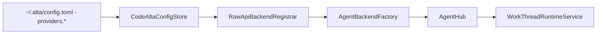
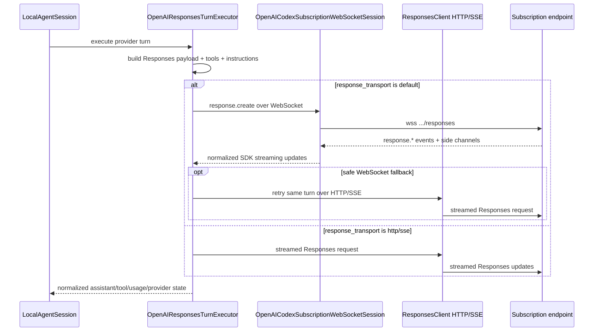

# Model providers

A model provider is the user-facing execution configuration for an LLM endpoint/runtime. Low-level runtime adapters still implement `IAgentBackend`, but frontend and configuration docs should use **model provider** for selectable entries in `config.toml` and the provider-management UI.

## Registration pipeline



At startup, `CodeAltaOwnedServices` loads provider definitions from `CodeAltaConfigStore` and passes them to `RawApiBackendRegistrar.RegisterConfiguredBackends`. Each valid enabled provider registers an `AgentBackendDescriptor` and a backend factory with `AgentBackendFactory`. `AgentHub` starts providers lazily when a model list, session list, create, or resume operation needs them.

Providers that are disabled, invalid, or missing required credentials are skipped without deleting their config entries.

## Config shape

Each provider is configured under `providers.<provider-key>`:

```toml
[chat]
default_provider = "work"

[providers.work]
enabled = true
display_name = "Work endpoint"
type = "openai-responses"
api_key_env = "WORK_ENDPOINT_API_KEY"
api_url = "https://api.example.test/v1"
model = "model-id"
reasoning_effort = "high"
models_dev_provider_id = "openai"

[providers.work.model_overrides.model-id]
context_window = 400000
output_token_limit = 128000
```

Important behavior:

- `enabled = false` prevents registration. Omitted `enabled` normalizes to `true` for user entries.
- `display_name` is optional; CodeAlta can derive a display name from the provider key.
- `model` and `reasoning_effort` are defaults, not a hard limit on model selection unless the provider is configured with `single_model_id`.
- `api_key` stores a literal secret; `api_key_env` points to an environment variable. Prefer environment variables for shared machines.
- `api_url`, organization/project fields, provider-specific auth fields, `extra_body`, `profile`, `compaction`, `models_dev_provider_id`, and `model_overrides` are preserved by the advanced TOML editor.
- The bundled template disables all built-ins explicitly. Users opt in by enabling/configuring a provider.

## Built-in provider types

`RawApiBackendRegistrar` currently recognizes these `type` values:

| `type` | Runtime adapter | Notes |
| --- | --- | --- |
| `openai-chat` | `CodeAlta.Agent.OpenAI` chat-completions executor | Requires API key. Supports streaming chat completions, strict function schema normalization, usage mapping, and optional protocol traces. |
| `openai-responses` | `CodeAlta.Agent.OpenAI` responses executor | Requires API key. Uses Responses streaming over HTTP by default and stores local CodeAlta session journals. |
| `codex` | `CodeAlta.Agent.OpenAI` responses executor with subscription options | Uses ChatGPT/Codex subscription credentials stored in CodeAlta state; not treated as an OpenAI platform API-key provider. |
| `copilot` | `CodeAlta.Agent.Copilot` direct HTTP executor | Uses configured token/device-flow auth and dispatches turns through compatible local-runtime executors according to the selected model. |
| `anthropic` | `CodeAlta.Agent.Anthropic` | Requires API key. Wraps SDK chat streaming through the local runtime and supports model metadata enrichment. |
| `google-genai` | `CodeAlta.Agent.GoogleGenAI` | Requires API key. Wraps SDK chat streaming through the local runtime and supports model metadata enrichment. |
| `vertex-ai` | `CodeAlta.Agent.GoogleGenAI` | Uses Vertex project/location settings instead of an API key. |

ACP backends are not raw provider entries. They are registered from `[acp.agents]` config and installed ACP definitions as backend ids of the form `acp:<agentId>`.

## Local-runtime provider behavior

OpenAI-compatible, Anthropic, Google, direct HTTP, and subscription-backed providers use the local runtime when they are registered by `RawApiBackendRegistrar`. They share these properties:

- sessions are CodeAlta-owned and journaled under `~/.alta/sessions/yyyy/MM/dd/<session-id>.jsonl`;
- provider/model switches are represented as events in the journal when history can be replayed safely;
- tool declarations are generated from CodeAlta `AgentToolDefinition` values;
- system/developer instructions and project context are composed by CodeAlta before the provider turn;
- compaction is implemented locally through provider summarizer calls;
- model metadata is enriched from upstream discovery, bundled/static metadata, refreshed models.dev data, and user `model_overrides` where available.

## OpenAI-compatible providers

`openai-chat` uses streaming chat completions. The adapter maps content, reasoning, tool calls, usage, and finish reasons into normalized `AgentEvent` values. Tool schemas are normalized for strict function-schema requirements.

`openai-responses` uses Responses streaming over HTTP. `response_transport = "http"` and `response_transport = "sse"` both force the HTTP path in current code. WebSocket transport is configured only for subscription-backed `codex` providers.

Provider profiles can adjust role support and reasoning replay details. For endpoints that do not support developer-role messages, defaults can merge developer guidance into system content. Profiles and `extra_body` remain provider-specific and should be documented in provider examples only when a concrete endpoint requires them.

## Subscription-backed `codex` provider

The `codex` provider type is dedicated ChatGPT/Codex subscription endpoint access. It is intentionally distinct from OpenAI platform API-key access.

Current behavior:

- default endpoint: `https://chatgpt.com/backend-api/codex`;
- default auth source: `codealta_oauth`;
- supported auth sources: `codealta_oauth`, `codex_auth_import`, and `codex_auth_file_readonly`;
- default response transport: WebSocket with HTTP fallback;
- `response_transport = "http"` or `"sse"` forces the HTTP/SSE SDK path;
- encrypted reasoning is included by default;
- model discovery defaults to a static allow-list unless configured for endpoint discovery;
- `send_installation_id` defaults to `false` and sends a CodeAlta-owned stable id only when explicitly enabled;
- requests use CodeAlta-owned stored subscription credentials and do not convert subscription tokens into platform API keys.

CodeAlta does not rotate accounts, bypass provider limits, or silently fall back to a different provider when this provider reports quota or authentication failures.

### Subscription transport details



Implementation notes verified against `OpenAIResponsesTurnExecutor` and `OpenAICodexSubscriptionWebSocketSession`:

- Ordinary `openai-responses` providers always use the HTTP/SSE SDK path. The WebSocket path is created only when `provider.CodexSubscription` is set.
- The WebSocket URI is the configured base URI with `/responses` appended when needed and `http/https` changed to `ws/wss`.
- WebSocket handshakes send bearer subscription auth plus `OpenAI-Beta: responses_websockets=2026-02-06`, `originator: codealta`, `session_id`, `x-client-request-id`, `User-Agent`, optional `ChatGPT-Account-Id`, optional `X-OpenAI-Fedramp`, and captured `x-codex-turn-state` when present.
- HTTP/SSE requests use the SDK `ResponsesClient` with subscription auth policy and `CodexSubscriptionHeadersPolicy`. That policy sends `originator`, optional account/session headers, optional `OpenAI-Beta: responses=experimental`, and captures `x-codex-turn-state` from responses.
- Codex subscription request customization disables stored output, keeps streaming enabled, omits `max_output_tokens`, enables auto tool choice, adds encrypted reasoning when configured, sets `prompt_cache_key` to the CodeAlta session id, sets `text.verbosity`, and optionally adds `client_metadata.x-codex-installation-id`.
- Active in-memory WebSocket sessions can reuse provider continuation with `previous_response_id` only when the replayed request prefix still matches. This continuation is not a persisted recovery mechanism; journals remain the durable source of truth.
- WebSocket sessions are cached per CodeAlta session and expire after an idle timeout, defaulting to five minutes.
- The turn executor retries subscription streams with a small bounded budget and `Retry-After`/exponential backoff when it is safe to retry. It avoids retrying after committed final content, dispatched tool side effects, or observed tool-call items.
- A WebSocket attempt can switch to HTTP/SSE fallback before visible output or after WebSocket retry exhaustion. Authentication failures can trigger one credential refresh only before visible output is emitted.
- `max_concurrent_requests` defaults to `16` per provider/account and is enforced locally to avoid unbounded parallel subscription requests from one CodeAlta process.

Relevant config keys for `type = "codex"` include `auth_source`, `account_id`, `max_concurrent_requests`, `text_verbosity`, `include_encrypted_reasoning`, `model_discovery`, `response_transport`, `send_responses_beta_header`, `send_installation_id`, `installation_id_source`, and `experimental`.

## Direct HTTP `copilot` provider

The `copilot` provider type registers direct HTTP access through `CodeAlta.Agent.Copilot`. Supported auth sources are device-flow, a GitHub-token environment variable, or a provider-token environment variable. Device-flow and GitHub-token auth exchange for a provider token and cache CodeAlta-owned credentials under the global state root.

Model discovery uses the provider `/models` endpoint with a static fallback according to configuration. Per-model dispatch selects the compatible local-runtime executor for Responses, chat-completions, or messages-style turns. Optional settings control enterprise domain, model-policy handling, preview model inclusion, single-model pinning, model overrides, and protocol tracing.

## Anthropic and Google providers

`anthropic`, `google-genai`, and `vertex-ai` are implemented local-runtime providers, not placeholders. They wrap SDK chat streaming through `LocalAgentChatClientTurnExecutor`, list upstream models when supported, and can be constrained with `single_model_id`.

`vertex-ai` uses project/location configuration and application-default/environment credentials expected by the Google SDK. `google-genai` uses API-key configuration. Both can use `models_dev_provider_id` and `model_overrides` for context-window and output-limit metadata.

## Model metadata and context limits

CodeAlta combines model metadata from:

1. upstream model-list APIs when available;
2. provider-specific static fallback lists for selected providers;
3. the bundled `src/CodeAlta.Agent/Data/models_dev_db.json` snapshot;
4. a refreshed cache under `~/.alta/cache/model-catalog/`;
5. user `model_overrides` in `config.toml`.

Context usage uses the resolved input-token limit. If only `context_window` is known, it is treated as the practical input limit. If both total context and output limit are known, CodeAlta derives input capacity from `context_window - output_token_limit` unless an explicit input limit is configured.

To refresh the bundled models.dev snapshot manually:

```sh
dotnet run --project src/CodeAlta.Agent.ModelsDev.Updater/CodeAlta.Agent.ModelsDev.Updater.csproj -c Release
```

## Compaction configuration

Local-runtime providers can set a `compaction` block:

```toml
[providers.work.compaction]
enabled = true
ratio = 0.95
summary_output_ratio = 0.10
post_compaction_target_ratio = 0.10
summary_share_of_target = 0.40
file_context_share_of_summary_target = 0.15
keep_last_user_message = true
allow_split_turn = true
```

The provider-management UI omits properties that match built-in defaults when saving. See [Runtime and agent sessions](runtime.md#compaction) for trigger and checkpoint behavior.

## Protocol tracing

For supported providers, `protocol_trace = true` writes a trace file under `~/.alta/sessions/traces/<session-id>.trace`. Credential headers are redacted, but traces can contain prompts, generated output, tool arguments/results, file names, and streamed SDK updates. Keep tracing disabled except during targeted local diagnostics.

## Provider-management UI

The model providers dialog edits `~/.alta/config.toml` through the same store used at startup. It supports provider add/delete, enable/disable, validation, credential-source edits, connectivity tests, login flows for providers that require them, advanced TOML editing, and refreshing the runtime after a valid save.

Startup validates existing global config before constructing provider runtimes. Invalid config opens a recovery editor and blocks provider/session startup until the file is valid or the process exits.
