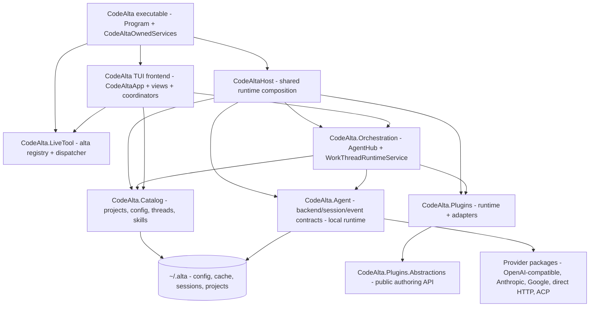

# CodeAlta internal documentation

This folder documents the current CodeAlta 1.0 implementation. It is not a backlog, comparison document, or archive of earlier design drafts. Public user documentation lives under `site/`; the files here are for maintainers who need to understand the code, runtime boundaries, and extension points.

## Reading path

Read the documents in this order when onboarding or reviewing architecture-sensitive changes:

| Step | Document | Purpose |
| --- | --- | --- |
| 1 | [Architecture overview](architecture.md) | Process composition, project layering, frontend/runtime boundaries, and the main data flow. |
| 2 | [Catalog, configuration, and state](catalog-and-config.md) | `~/.alta` layout, project-local state, TOML configuration, projects, threads, sessions, and prompt drafts. |
| 3 | [Runtime and agent sessions](runtime.md) | `IAgentBackend`/`IAgentSession`, `AgentHub`, work-thread orchestration, system prompts, tools, compaction, and journals. |
| 4 | [Model providers](providers.md) | Provider registration, configured provider types, local-runtime adapters, model metadata, credentials, and protocol tracing. |
| 5 | [`alta` live tool](live-tool.md) | In-process command registry, JSONL output contract, session control commands, queueing, delegated work, and plugin commands. |
| 6 | [ACP integration](acp.md) | ACP stdio transport, backend registration, install registry support, client capability bridges, and unsupported operations. |
| 7 | [Plugins](plugins.md) | Trusted source plugins, public authoring API, runtime build/load flow, contributions, safe mode, and built-in plugins. |
| 8 | [Skills](skills.md) | Filesystem `SKILL.md` discovery, validation, precedence, UI/live-tool activation, and runtime injection. |
| 9 | [Orchestration actor model](orchestration-actor-model.md) | Internal mailbox/actor ownership rules for runtime mutation and event backpressure. |
| 10 | [Development guide](development-guide.md) | Repository-wide rules that contributors and automation should follow. |
| 11 | [Specs index](specs/readme.md) | Current policy for adding focused implementation specs. |

## System map

The executable is the interactive terminal host. Reusable session/thread orchestration lives in runtime libraries, not in terminal controls. `CodeAltaHost.CreateAsync` is the shared composition entry point: it creates the catalog, plugin runtime, skill catalog, backend factory, `AgentHub`, `WorkThreadRuntimeService`, and project-file search service. The TUI then composes views and frontend coordinators around those services.

## Current source roles

| Source root | Role |
| --- | --- |
| `src/CodeAlta` | Executable, terminal UI composition, shell controller, dialogs, view models, provider-management UI, and owned process services. |
| `src/CodeAlta.Orchestration` | Headless runtime composition and work-thread orchestration. It references `CodeAlta.Agent`, `CodeAlta.Catalog`, and `CodeAlta.Plugins`, not the TUI. |
| `src/CodeAlta.Agent` | Normalized backend/session/event contracts plus the local raw-API session runtime, tools, journals, prompt instruction composition, and compaction. |
| `src/CodeAlta.Agent.*` | Provider-specific adapters and ACP backend integration that implement the agent contracts. |
| `src/CodeAlta.Catalog` | Global/project catalog, config loading/normalization, project descriptors, work-thread metadata, skill discovery, and ACP install/config metadata. |
| `src/CodeAlta.LiveTool` | In-process `alta` command contributors, registry, dispatcher, transcript formatter, and agent-tool wrapper. |
| `src/CodeAlta.Plugins.Abstractions` | Public plugin authoring contracts. |
| `src/CodeAlta.Plugins` | Trusted plugin discovery, source builds, loading, activation, contribution registry, adapters, and plugin resource roots. |
| `src/CodeAlta.Plugin.Statistics` | Built-in plugin implemented through the same plugin model used by source plugins. |
| `src/CodeAlta.Acp` | ACP JSON-RPC, protocol models, registry/install support, and generated protocol helpers. |
| `src/CodeAlta.Tests`, `src/CodeAlta.*.Tests` | MSTest suites, including architecture guardrails for frontend/runtime boundaries and concurrency decisions. |

`src/CodeAlta.Hosting` is not an active project in the solution. Shared host composition is `CodeAlta.Orchestration.Hosting.CodeAltaHost`.

## Durable state quick reference

CodeAlta's default global root is `~/.alta`. Important roots are:

- `config.toml` for global chat/provider/plugin/ACP configuration;
- `projects/` for project descriptors;
- `sessions/yyyy/MM/dd/<session-id>.jsonl` for local-runtime session journals and CodeAlta thread headers/state;
- `sessions/traces/<session-id>.trace` for optional protocol traces;
- `cache/` for machine-local caches such as refreshed model metadata;
- `auth/` for provider credential/token stores owned by provider auth managers;
- `acp/` for ACP registry cache, downloads, installs, manifests, and state;
- `saved_prompts/` for unsent prompt drafts;
- `ui-state.yaml` for frontend view/thread selection state;
- `plugins/` and `skills/` for user-scoped source plugins and skills.

Project-local configuration and extensions live under `<project>/.alta/`, including `<project>/.alta/config.toml`, `<project>/.alta/plugins/`, and `<project>/.alta/skills/`.

## Documentation rules

- Describe current implementation first. Do not keep superseded plans in tracked docs.
- Verify behavior against `src/**`, tests, default config, and solution metadata before documenting it.
- Keep high-level documents linked from this page; add focused specs only when a stable implementation contract needs more detail.
- Prefer implementation terms used in the code: model provider for user-facing runtime configuration; backend for low-level `IAgentBackend` adapters.
- Keep comparisons to other products and agents out of internal docs unless a configured provider/protocol name is required to explain CodeAlta behavior.
