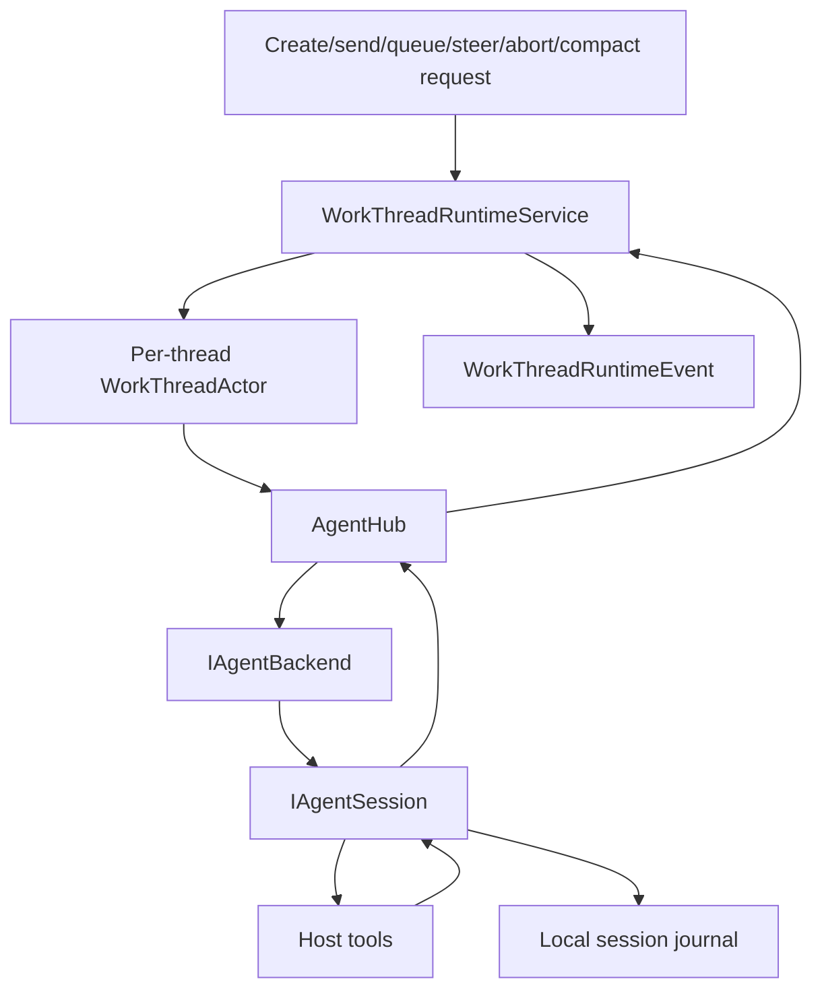

# Runtime and agent sessions

The runtime turns shell or live-tool requests into ordered work-thread commands, provider sessions, normalized events, journals, and UI/plugin projections. This document describes the headless runtime contracts; frontend rendering is covered by [Architecture overview](architecture.md).

## Runtime layers

`WorkThreadRuntimeService` is the public runtime service used by the TUI, `alta` commands, and plugin orchestration adapters. It owns work-thread creation, coordinator-session setup, prompt queueing, prompt sending, steering fallback, abort, manual compaction, skill activation, runtime event publication, and thread metadata journaling.

`AgentHub` owns backend/session lifecycle. It lazily creates and starts backends from `AgentBackendFactory`, caches active sessions, lists models and recoverable sessions, resumes sessions, and exposes normalized metadata to orchestration.

Same-thread mutation is serialized by internal mailbox actors. Callers use request records, ids, snapshots, and events; actor references are never public API.

## Agent contracts

`CodeAlta.Agent` defines the provider-neutral contract.

### `IAgentBackend`

A backend owns a model/runtime adapter. It exposes:

- `BackendId` and `DisplayName`;
- `StartAsync` and `StopAsync` lifecycle methods;
- `ListModelsAsync`;
- `ListSessionsAsync` for recoverable sessions;
- `CreateSessionAsync` and `ResumeSessionAsync`;
- best-effort `DeleteSessionAsync`, which returns `false` when unsupported.

### `IAgentSession`

A session owns one conversation. It exposes:

- normalized event streaming through `StreamEventsAsync` and `Subscribe`;
- `SendAsync` for normal user input;
- `SteerAsync` for live steering when a backend supports it;
- `AbortAsync` for best-effort cancellation;
- `CompactAsync` for manual compaction when supported;
- `GetHistoryAsync` for replayable stored history.

### `AgentEvent`

`AgentEvent` is a polymorphic normalized model. Current event families include raw provider events, content deltas/completions, activity lifecycle events, system-prompt records, session updates, plan snapshots, interactions, errors, permission requests, file-change permission requests, command permission requests, and user-input requests.

Runtime projections should be derived from these normalized events rather than provider-specific payloads whenever possible.

## Work-thread flow

A normal prompt follows this path:

1. The caller selects a global or project thread and model provider.
2. `WorkThreadRuntimeService` ensures a coordinator session exists for the thread.
3. System/developer instructions, runtime context, project context, skills metadata, and tool definitions are composed.
4. `AgentHub` starts or resumes the selected backend/session.
5. The prompt is sent through `IAgentSession.SendAsync`.
6. Normalized `AgentEvent` values are observed, persisted when applicable, and converted into `WorkThreadRuntimeEvent` values.
7. The runtime marks the thread idle, updates usage/state, and drains at most one queued prompt for that thread.

Busy-thread sends are queued when requested by UI or live-tool options. Queue items keep caller attribution and are durable enough for runtime recovery paths that read thread/session state. Steering requests are sent only when the backend has an active run and supports `SteerAsync`; otherwise CodeAlta falls back to normal send or re-queues according to the caller path.

## Local raw-API runtime

`LocalAgentBackend` and `LocalAgentSession` implement CodeAlta-owned local sessions for raw provider APIs. Provider packages create a `LocalAgentBackend` with a provider-specific turn executor, profile, model catalog, credentials, and compaction settings.

A local session:

- replays the session journal into local conversation state on resume;
- composes provider messages from normalized history, instructions, tool results, and active context;
- emits normalized content/activity/session/permission/error events;
- runs model/tool turns until the provider is idle;
- can transfer replayable local history to another compatible configured local provider when no exact provider state exists;
- persists session summary/state snapshots and CodeAlta thread headers/state into the same JSONL journal.

The journal path is `~/.alta/sessions/yyyy/MM/dd/<session-id>.jsonl`. Optional traces live at `~/.alta/sessions/traces/<session-id>.trace` when protocol tracing is enabled for a provider.

## Built-in local tools

Local raw-API providers can receive host-injected tools. Current built-ins are:

- `read_file`
- `list_dir`
- `grep`
- `webget`
- `shell_command`
- `write_file`
- `replace_in_file`
- `delete_file_or_dir`
- `rename_file_or_dir`
- `apply_patch`

Mutation and shell tools flow through host permission handling. Tool schemas are bridged to provider-specific declarations, including strict-schema normalization where required. A user-input/request tool is intentionally not registered as a local raw-API built-in until host UI pause/resume semantics are implemented.

The `alta` live tool is injected separately for configured backend ids that support host tools. See [`alta` live tool](live-tool.md).

## System prompt and instruction composition

System prompts are file-backed and layered from shipped, user, project, and plugin resource roots. `SystemPromptBuilder` composes:

- native system prompt content;
- developer prompt parts;
- generated runtime/tool guidance;
- skills metadata when CodeAlta can manage skill activation for the selected session;
- project-context sections and file/reference context;
- plugin-contributed prompt parts.

`LocalAgentInstructionComposer` then adds local-runtime context and project instruction files unless equivalent content is already present. Provider-managed skill sessions may omit CodeAlta-managed skill advertisements while still receiving parent/additional developer guidance that orchestration explicitly supplies.

Instruction composition should remain deterministic and file-backed. Avoid embedding large static prompt strings directly in orchestration code when they belong in prompt resources.

## Compaction

Local-runtime compaction is implemented in `LocalAgentSession` and the `CodeAlta.Agent.LocalRuntime.Compaction` namespace. It is a provider-call workflow, not a separate remote compaction API.

Triggers:

- **Manual:** caller invokes `IAgentSession.CompactAsync` through the UI or `alta session compact`.
- **Threshold:** automatic compaction is considered before turns and after idle when projected active context reaches the resolved input-context limit times the configured ratio.
- **Overflow recovery:** the runtime can compact after provider context-limit failures when the session can still be summarized.

Defaults from `LocalAgentCompactionSettings`:

| Setting | Default |
| --- | ---: |
| `enabled` | `true` |
| `ratio` | `0.95` |
| `post_compaction_target_ratio` | `0.10` |
| `summary_output_ratio` | `0.10` |
| `summary_share_of_target` | `0.40` |
| `file_context_share_of_summary_target` | `0.15` |
| `keep_last_user_message` | `true` |
| `allow_split_turn` | `true` |

The summarizer is an ordinary provider turn executed through the same turn executor. Checkpoints are persisted as `local.compactionCheckpoint` raw events, and visible session updates mark compaction start/completion. Activated CodeAlta-managed skills can be rehydrated into composed instructions after compaction so skill guidance survives without duplicating current context.

Generic ACP sessions currently do not support manual compaction.

## Persistence model

Local-runtime session journals contain replayable normalized history plus raw state records:

- `local.sessionSummary` for session summary metadata;
- `local.sessionState` for local runtime replay state;
- `local.compactionCheckpoint` for compaction outcomes;
- `codealta.threadHeader` and `codealta.threadState` for CodeAlta work-thread metadata.

The runtime reads journals to restore recoverable threads, session history, usage, modified-file summaries, activated-skill state, and provider/model selections. The frontend stores only view/prompt state outside the journal.

## Runtime events and plugins

`WorkThreadRuntimeEvent` is the orchestration-to-host event stream. The frontend projects it into sidebars, timelines, status lines, usage indicators, and dialogs. Plugins can observe normalized agent events and contribute transient derived thread events through the plugin orchestration bridge.

Derived plugin events are not canonical transcript entries. They are replayed from stored normalized events and can be recalculated after restart.

## Error and cancellation behavior

Backends and sessions should surface recoverable failures as structured events or command outcomes when possible. Unrecoverable actor failures stop the affected actor and complete pending replies. Runtime event streams are bounded; callers must not depend on unbounded buffering for UI or plugin responsiveness.
