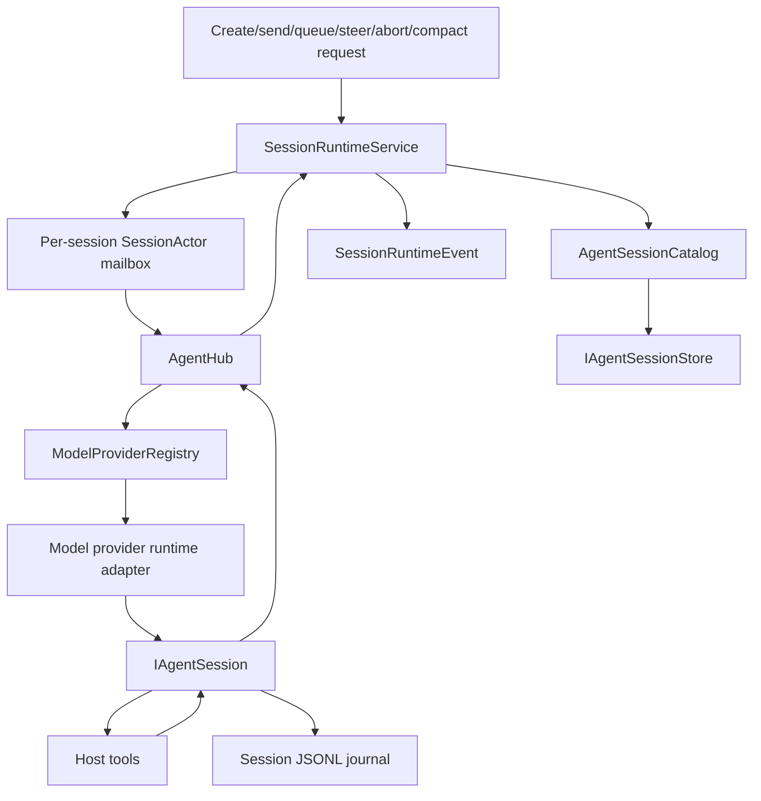

# Runtime and agent sessions

The runtime turns shell, plugin, and live-tool requests into CodeAlta-owned sessions, ordered per-session commands, normalized events, journals, and UI/plugin projections. Model providers execute turns and expose model metadata, but they do not own persisted session discovery.

## Runtime layers

`SessionRuntimeService` is the public runtime service used by the TUI, `alta` commands, and plugin orchestration adapters. It owns session-view creation, coordinator-session setup, prompt queueing, prompt sending, steering fallback, abort, manual compaction, skill activation, runtime event publication, and legacy session-view/session-view metadata journaling.

`AgentHub` is the active CodeAlta agent/session facade. It starts or resumes runnable sessions by resolving the selected `ModelProviderId`/provider key through `IModelProviderRegistry`, then coordinates run/abort/steer/compact operations through per-session handles. It does not list persisted sessions and does not probe providers for models.

`AgentSessionCatalog` and `IAgentSessionStore` own durable session discovery and history reads. `ListSessionsAsync` is streaming-only (`IAsyncEnumerable<AgentSessionMetadata>`) and reads from one configured sessions root for the current runtime.

Same-session mutation is serialized by internal mailbox actors and session coordinators. Different sessions can run concurrently; a blocked provider call, tool execution, or journal append for one session must not serialize unrelated sessions. Runtime events use bounded streams so slow readers do not create unbounded memory pressure.

## Provider initialization

`IModelProviderRegistry` lists configured `ModelProviderDescriptor` values and creates provider runtimes. `IModelProviderInitializationService` starts provider probes eagerly after provider descriptors/configuration are available. Each provider probe owns its success/failure state and model list cache:

- provider initialization is independent per provider and fault-isolated;
- one slow or failing provider does not block other providers;
- session listing, local history loading, project import, and pending-session restore do not wait for provider readiness;
- model lists are loaded during provider initialization or explicit refresh, then reused by session start/resume paths.

Provider identity is not session ownership. Persisted sessions keep last-used provider/model metadata for UX defaults and resume choices; the session id remains the durable session identity. When CodeAlta starts a new or empty session, it generates the canonical session id before provider attachment, passes it to the agent/provider runtime, and treats a different returned id as a provider contract violation rather than rekeying the session.

## Agent contracts

`CodeAlta.Agent` defines the headless agent/session/provider boundary.

### Provider compatibility names

Provider runtime adapters use `ModelProviderId`, `ModelProviderDescriptor`, `IModelProviderRegistry`, and `IModelProviderRuntime` for selectable providers. Do not reintroduce `IAgentBackend`, `AgentBackendId`, or `AgentBackendFactory`, and do not use backend terminology to imply that providers own persisted sessions.

### `IAgentSession`

A session owns one conversation/run attachment. It exposes:

- normalized event streaming through `StreamEventsAsync` and `Subscribe`;
- `SendAsync` for normal user input;
- `SteerAsync` for live steering when the selected provider/runtime supports it;
- `AbortAsync` for best-effort cancellation;
- `CompactAsync` for manual compaction when supported;
- `GetHistoryAsync` for replayable stored history.

### `AgentEvent`

`AgentEvent` is a polymorphic normalized model. Current event families include raw provider events, content deltas/completions, activity lifecycle events, system-prompt records, session updates, plan snapshots, interactions, errors, permission requests, file-change permission requests, command permission requests, and user-input requests.

Runtime projections should be derived from these normalized events rather than provider-specific payloads whenever possible.

## Session flow

A normal prompt follows this path:

1. The caller selects a global or project session view and model provider.
2. `SessionRuntimeService` ensures a coordinator session exists for the session view.
3. System/developer instructions, runtime context, project context, skills metadata, and tool definitions are composed.
4. `AgentHub` starts or resumes the CodeAlta session using the selected provider runtime.
5. The prompt is sent through `IAgentSession.SendAsync`.
6. Normalized `AgentEvent` values are observed, persisted when applicable, and converted into `SessionRuntimeEvent` values.
7. The runtime marks the session idle, updates usage/state, and drains at most one queued prompt for that session.

Busy-session sends are queued when requested by UI or live-tool options. Queue items keep caller attribution and are durable enough for runtime recovery paths that read session state. Steering requests are sent only when a run is active and the provider/runtime supports `SteerAsync`; otherwise CodeAlta falls back to normal send or re-queues according to the caller path.

## Agent session runtime

`AgentRuntime` and `AgentSession` implement CodeAlta-owned local sessions for raw provider APIs. Provider packages create model-provider runtimes with provider-specific turn executors, profiles, model catalogs, credentials, and compaction settings; the session runtime attaches those providers when starting or resuming work.

A local session:

- replays the session journal into local conversation state on resume;
- composes provider messages from normalized history, instructions, tool results, and active context;
- emits normalized content/activity/session/permission/error events;
- runs model/tool turns until the provider is idle;
- can transfer replayable local history to another compatible configured provider when no exact provider continuation state exists;
- persists session summary/state snapshots and legacy session-view headers/state into the same JSONL journal.

The journal path is `~/.alta/sessions/yyyy/MM/dd/<session-id>.jsonl`. Optional traces live at `~/.alta/sessions/traces/<session-id>.trace` when protocol tracing is enabled for a provider.

## Built-in local tools

CodeAlta-runtime providers can receive host-injected tools. Current built-ins are:

- `read_file`
- `list_dir`
- `grep`
- `webget`
- `shell_command`
- `write_file`
- `replace_in_file`
- `delete_file_or_dir`
- `rename_file_or_dir`
- `apply_patch`

Mutation and shell tools flow through host permission handling. Tool schemas are bridged to provider-specific declarations, including strict-schema normalization where required. A user-input/request tool is intentionally not registered as a local raw-API built-in until host UI pause/resume semantics are implemented.

The `alta` live tool is injected for configured provider ids that support host tools. See [`alta` live tool](live-tool.md).

MCP uses progressive, policy-controlled `AgentToolDefinition` registration for session-activated MCP servers, with `alta mcp tool search|describe|call` remaining available for discovery, diagnostics, and manual invocation. The compact MCP prompt inventory is built from configuration without connecting; activated servers are connected lazily on agent runs, apply TOML policy (`enabled`, `allowed_tools`, `disabled_tools`, timeouts, output caps), and redact diagnostics/results. Timeline refinements for friendly direct-tool labels and automatic refresh on `tool-list-changed` notifications are follow-up work. See [MCP support](mcp.md).

## System prompt and instruction composition

System prompts are file-backed and layered from shipped, user, project, and plugin resource roots. `SystemPromptBuilder` composes:

- native system prompt content;
- developer prompt parts;
- generated runtime/tool guidance;
- skills metadata when CodeAlta can manage skill activation for the selected session;
- project-context sections and file/reference context;
- plugin-contributed prompt parts.

`AgentInstructionComposer` then adds agent-runtime context and project instruction files unless equivalent content is already present. Provider-managed skill sessions may omit CodeAlta-managed skill advertisements while still receiving parent/additional developer guidance that orchestration explicitly supplies.

Instruction composition should remain deterministic and file-backed. Avoid embedding large static prompt strings directly in orchestration code when they belong in prompt resources.

## Compaction

Agent-runtime compaction is implemented in `AgentSession` and the `CodeAlta.Agent.Runtime.Compaction` namespace. It is a provider-call workflow, not a separate remote compaction API.

Triggers:

- **Manual:** caller invokes `IAgentSession.CompactAsync` through the UI or `alta session compact`.
- **Threshold:** automatic compaction is considered before turns and after idle when projected active context reaches the resolved input-context limit times the configured ratio.
- **Overflow recovery:** the runtime can compact after provider context-limit failures when the session can still be summarized.

Defaults from `AgentCompactionSettings`:

| Setting | Default |
| --- | ---: |
| `enabled` | `true` |
| `ratio` | `0.95` |
| `post_compaction_target_ratio` | `0.10` |
| `summary_output_ratio` | `0.10` |
| `summary_share_of_target` | `0.40` |
| `file_context_share_of_summary_target` | `0.15` |
| `keep_last_user_message` | `true` |
| `allow_split_turn` | `true` |

The summarizer is an ordinary provider turn executed through the same turn executor. Checkpoints are persisted as `local.compactionCheckpoint` raw events, and visible session updates mark compaction start/completion. Activated CodeAlta-managed skills can be rehydrated into composed instructions after compaction so skill guidance survives without duplicating current context.

## Persistence model

Agent-runtime session journals contain replayable normalized history plus raw state records:

- `local.sessionSummary` for session summary metadata;
- `local.sessionState` for agent runtime replay state;
- `local.compactionCheckpoint` for compaction outcomes;
- `codealta.sessionHeader` and `codealta.sessionState` for legacy session-view/session-view metadata.

The runtime reads journals to restore recoverable sessions, session history, usage, modified-file summaries, activated-skill state, parent/sub-session lineage, and provider/model selections. The frontend stores only view/prompt state outside the journal.

## Runtime events and plugins

`SessionRuntimeEvent` is the current orchestration-to-host event stream name. It is a transitional legacy type name; events describe session-view/runtime changes, not operating-system sessions. The frontend projects it into sidebars, timelines, status lines, usage indicators, and dialogs. Plugins can observe normalized agent events and contribute transient derived timeline cards through the plugin orchestration bridge.

Derived plugin events are not canonical transcript entries. They are replayed from stored normalized events and can be recalculated after restart.

## Error and cancellation behavior

Providers and sessions should surface recoverable failures as structured events or command outcomes when possible. Unrecoverable actor failures stop the affected session actor and complete pending replies. Runtime event streams are bounded; callers must not depend on unbounded buffering for UI or plugin responsiveness.
