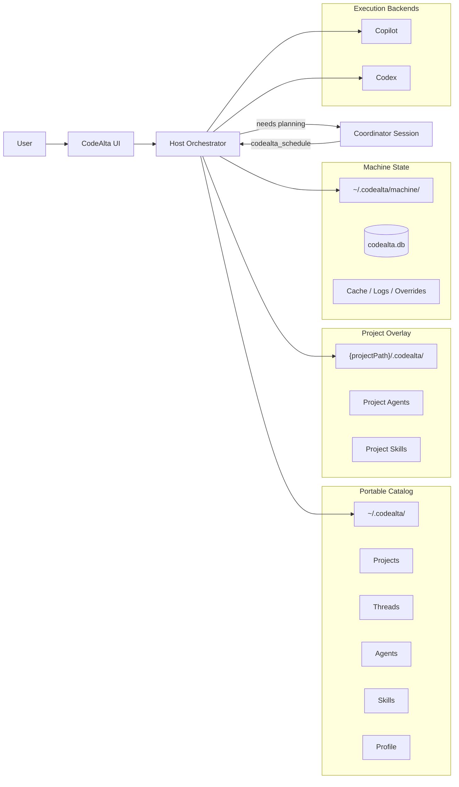
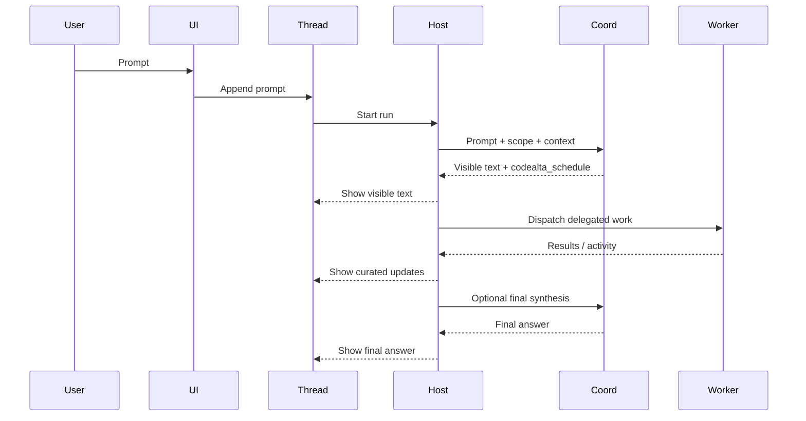

# CodeAlta Project-First Architecture

Status: **Proposal**  
Audience: `CodeAlta`, `CodeAlta.Agent*`, `CodeAlta.Orchestration`, `CodeAlta.Catalog` (or the current `CodeAlta.Workspaces` during migration), `CodeAlta.Persistence`, and UI implementers.

Related specs:

- `doc/specs/readme.md`
- `doc/specs/filesystem_metadata_catalog_spec.md`
- `doc/specs/agent_api_specs.md`
- `doc/specs/agent_configuration_spec.md`
- `doc/specs/agent_instruction_templates_spec.md`
- `doc/specs/template_system_spec.md`

## 1. Why this document exists

CodeAlta needs a simpler, lower-friction runtime model than the workspace-first design we had before.

The main problem with the earlier direction was not technical elegance. It was user cost:

- the user could not work on a project without first creating a workspace
- the UI forced structural decisions before useful work could start
- the scope model was more rigid than how people actually use coding agents today

The better model is:

- projects are first-class
- projects are discovered automatically
- user-facing work happens in project threads or global threads
- the host orchestrator owns routing and delegation
- richer grouping such as tags can come later without blocking the MVP

## 2. Core architecture decision

CodeAlta should be built around a **host-owned orchestrator** plus a **filesystem-first project catalog**.

That means:

- durable state lives in plain text under `~/.codealta/`
- machine-local operational state lives under `~/.codealta/machine/`
- the orchestrator, written in C#, owns routing, dispatch, lifecycle, and recovery
- Copilot and Codex are execution backends, not the owners of orchestration
- the MVP works without mandatory workspaces
- project grouping is optional metadata, not a prerequisite for use

## 3. Design principles

### 3.1 Project-first, not workspace-first

The first durable unit a user should care about is the project.

The practical consequences are:

- opening a project folder is enough to start using CodeAlta
- CodeAlta should upsert that project automatically
- the project list should grow naturally from actual usage
- users should not have to model their work before they can benefit from the tool

### 3.2 Threads are the UX unit

The durable user-facing unit is the **Work Thread**.

The user does not talk to “the orchestrator” directly. The user talks through a thread.

Thread kinds:

- **Project Thread**
- **Global Thread**
- **Internal Thread** (host-owned, inspectable, but not a primary user-facing conversation)

### 3.3 Host-owned orchestration

The host decides:

- which thread receives a prompt
- whether a response should stay direct or become coordinated work
- whether new internal or project threads must be created
- when worker/reviewer/verifier roles should be spawned
- how thread results are summarized back to the user

Models may suggest routing decisions, but CodeAlta remains the authority.

### 3.4 Filesystem-first durable state

Human-visible state is a product feature, not merely a debugging aid.

Durable state should be:

- readable in a text editor
- versionable in git
- copyable across machines
- inspectable without opening SQLite

### 3.5 Backend-agnostic core

Copilot and Codex should not define the product model.

The core abstractions belong to CodeAlta:

- projects
- threads
- runs
- route decisions
- agents
- activity streams
- durable summaries

Backends are adapters that implement execution semantics.

## 3.6 Module boundary

The active architecture needs a clearer project boundary than the current codebase exposes.

The current project name `CodeAlta.Workspaces` is misleading under the project-first model. The responsibilities it currently carries are closer to a filesystem catalog/discovery layer than to a workspace domain.

Recommended target split:

- `CodeAlta.Catalog`
  - project descriptors
  - project discovery and upsert
  - catalog file loading/saving
  - project-local overlays
  - agent and skill catalog loading
  - lightweight host-owned internal-thread linkage records
  - machine override and path-template resolution related to project location recovery
- `CodeAlta.Persistence`
  - SQLite access
  - repositories backed by SQLite
  - caches and rebuildable indexes
  - artifact/file-store mechanics where the concern is storage, not catalog semantics
- `CodeAlta.Orchestration`
  - routing
  - dispatch
  - coordinator/worker lifecycle
  - thread restoration decisions

`CodeAlta.Persistence` should not absorb catalog and discovery responsibilities.

`CodeAlta.Model` is not recommended at this stage. It would be too vague and would likely become a generic type bucket before there is a concrete dependency problem that justifies extracting pure contracts.

## 4. System model

CodeAlta should be understood as five connected layers.

## 4.1 System overview

Key reading:

- `~/.codealta/` is the global durable root
- `{projectPath}/.codealta/` is the project-local overlay
- `~/.codealta/machine/` is local runtime/index/cache state
- the host orchestrator is the hub for all thread and session communication

## 4.2 Projects

A project is the durable definition of a codebase or local code root.

For the MVP, a project should capture:

- stable `id`
- stable `slug`
- human `display_name`
- local `path`
- optional descriptive metadata
- optional tags

Project discovery should be automatic.

Primary discovery sources:

- current working directory when CodeAlta starts
- known durable project files under `~/.codealta/projects/`
- backend session history where a usable `cwd` or repository root can be inferred

### Important rule

The MVP should not require a “create project” setup step.

If CodeAlta can infer a project from where the user is working, it should upsert it.

## 4.3 Threads

Threads are the primary durable UX object.

### Project Thread

A project thread:

- belongs to exactly one project
- is user-facing
- owns one coordinator session
- has a fixed backend after creation; changing backend requires creating a new thread
- should use the backend session/thread id as its canonical runtime identity
- should be reopenable from the project view as the same backend-owned conversation, including its prior interaction history

### Global Thread

A global thread:

- is user-facing
- is not bound to one project
- may coordinate across multiple projects
- may create or steer project threads
- may summarize the state of other threads
- should use `~/.codealta/` as its working directory / session cwd so backend session history can recover it consistently
- has a fixed backend after creation; changing backend requires creating a new thread
- should use the backend session/thread id as its canonical runtime identity
- should be reopenable as the same backend-owned conversation, including its prior interaction history

There may be multiple global threads.

### Internal Thread

An internal thread:

- is host-owned
- is created for delegated work with a specific role
- is not a primary UI conversation surface
- remains inspectable by the user when needed
- is usually surfaced through summaries, activity cards, or a details/inspect view rather than as the main visible unit of work

Examples:

- reviewer child thread
- verifier child thread
- narrow planner or investigator child thread

## 4.4 Prompt ingress and control flow

There is no separate “front desk” session.

Normal flow:

1. user types into the selected thread
2. host orchestrator receives the prompt
3. host performs cheap pre-routing logic
4. if planning is needed, host sends to the thread coordinator
5. coordinator emits visible framing plus optional `codealta_schedule`
6. host validates and executes the schedule
7. worker results flow back to the host
8. host updates the thread timeline and may ask the coordinator for final synthesis

## 4.5 Coordinator

Each user-facing thread owns one coordinator session.

The coordinator is responsible for:

- interpreting the prompt in the current thread scope
- deciding whether work is direct or coordinated
- producing the scheduling envelope when coordinated work is needed
- optionally synthesizing final results

The coordinator is not responsible for:

- directly supervising workers
- directly messaging other sessions
- directly launching or aborting sessions

## 5. Scope rules

### 5.1 MVP scope model

The MVP scope model should be:

- `global`
- `project`

There is no mandatory workspace layer.

### 5.2 Grouping model

Project grouping should use lightweight metadata such as:

- tags
- labels
- inferred categories

Those groupings should remain optional and non-blocking.

A project may belong to multiple groupings in the future without forcing a single rigid hierarchy.

### 5.3 Why this scales better

This model scales better because:

- users already think in terms of projects on disk
- projects can be discovered from actual use
- threads stay simple and obvious
- cross-project work is handled by global threads, not by forcing all projects into a workspace container
- future grouping can remain flexible

## 6. UI model

The sidebar should be **project-first**.

Recommended structure:

- `Global Threads`
- `Projects`
  - project row
  - thread rows under that project

Thread-opening rule:

- selecting an existing thread from the sidebar should reopen that exact backend-owned conversation
- reopening means CodeAlta should recover the thread identity, working directory, backend, and prior interaction history from the backend session/thread store
- the user should continue the existing conversation, not start a synthetic replacement thread with only a summary

Project rows should show enough context to be useful:

- display name
- local path or shortened folder
- optional tags later
- recent activity marker

Tabs are first-class thread views.

Recommended behavior:

- opening a thread should open it in a tab
- multiple tabs may be open at once
- each tab should include its own close affordance
- closing a tab should close the UI view, not delete the underlying backend-owned thread
- reopening the same thread later should restore the existing conversation history again

Working-directory rule:

- global thread sessions should use `~/.codealta/` as their backend working directory
- project thread sessions should use the owning project's local `path`
- this gives global threads a stable cwd that can be rediscovered from Copilot/Codex session history

Backend-immutability rule:

- a thread keeps the backend it was created with
- the backend for an existing thread should not be changed in place
- if the user wants to continue the same logical work on another backend, CodeAlta should create a new thread or an explicit fork/clone of the existing one

The MVP should not expose project-management ceremony such as:

- mandatory workspace creation
- required manual project registration

## 7. Durable restoration model

CodeAlta should restore:

- known projects
- open project/global threads
- selected thread
- lightweight UI state that cannot be recovered from backend listings alone
- enough tab state to reopen the same set of visible thread tabs after restart

CodeAlta should not duplicate backend-owned thread transcripts or basic thread metadata by default.

Instead:

- Copilot/Codex remain the owners of raw session/thread history
- CodeAlta should prefer the backend session/thread id as the canonical thread id for project and global threads
- backend identity can be inferred from which backend emitted the session listing
- project/global scope can be inferred from cwd:
  - `~/.codealta/` => global thread
  - project `path` => project thread
- a display title can be derived from backend summary when available, or from the first user prompt

When a user selects a previous thread under a project or under the global thread list, CodeAlta should:

- enumerate backend-owned sessions for that backend
- match the selected backend session/thread id
- reopen the full conversation history exposed by that backend
- project the recovered history back into the CodeAlta thread view

The recovery target is the existing backend conversation, not a CodeAlta-authored replay transcript.

CodeAlta should only persist additional thread metadata when it owns information the backend does not:

- parent/child relationships for delegated internal work
- explicit UI grouping or pinned/open-tab state
- host-authored orchestration notes that are not part of backend history

It should not need to replay every raw event to make the UI useful again.

The durable source of truth should therefore be:

- project descriptors
- backend session listings
- minimal host-owned linkage/state when required

### Internal-thread caveat

Internal delegated threads are the one place where CodeAlta may need lightweight host-owned metadata.

Why:

- backend session/thread ids are only known after session creation
- cwd must be chosen before the backend creates the session
- therefore an internal-thread cwd cannot reliably include the backend-generated id at creation time

That means the following idea is attractive but not directly viable as the primary mechanism:

- `~/.codealta/threads/{backend-guid}/`

The backend guid is not available early enough.

A practical rule is:

- project/global threads should use backend-owned identity with no duplicated manifest by default
- internal delegated threads may use a host-chosen internal cwd marker under `~/.codealta/threads/` or `~/.codealta/internal/` when CodeAlta needs to classify and relate them
- if CodeAlta introduces such an internal marker, it should be justified only by parent/child orchestration recovery, not by a desire to duplicate normal thread metadata

SQLite remains machine-local support state, not the durable owner of the model.

## 8. Role of tags and future grouping

Tags should replace the MVP need for workspaces as the main grouping mechanism.

Examples:

- `dotnet`
- `cli`
- `xenoatom`
- `infra`
- `review-needed`

For the MVP:

- CodeAlta may infer tags automatically
- CodeAlta may persist tags in project metadata
- the UI does not need to expose full tag management yet

Future grouping ideas such as saved collections or optional workspaces can be added later if real usage shows they help.

## 9. What is deferred

The following remain later work:

- adaptive or proactive behavior
- semantic search and indexing
- MCP as a product feature
- self-learning and background suggestion systems
- rich project grouping UI

These should not drive the MVP architecture.

## 10. Final position

CodeAlta should evolve around:

- automatic project awareness
- low setup friction
- project/global thread ownership
- host-owned orchestration
- filesystem-first durable state
- backend-agnostic execution

That is the clearest path to a practical product that users can adopt without front-loaded setup.

