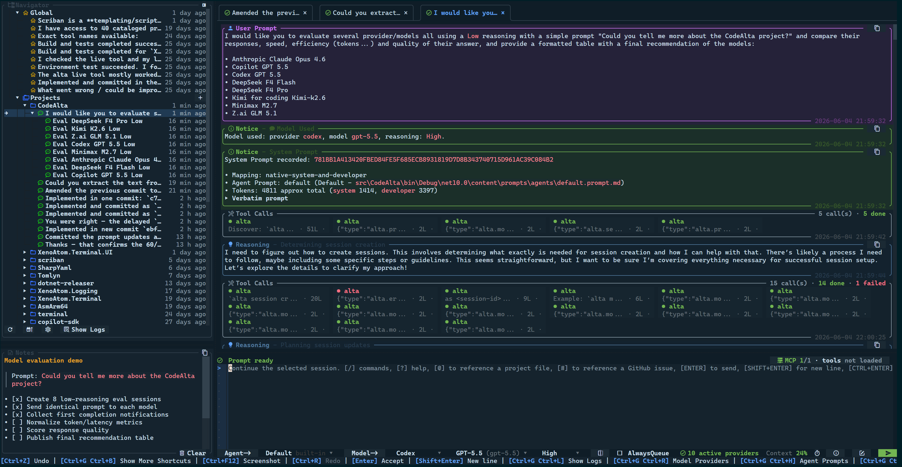

# CodeAlta [](https://github.com/CodeAlta/CodeAlta/actions/workflows/ci.yml) [](https://www.nuget.org/packages/CodeAlta/)

CodeAlta is a terminal workspace for agentic coding. It brings model-provider setup, project navigation, prompt attachments, threaded sessions, delegated work, and trusted local plugins behind the `alta` command.

> CodeAlta is pre-release software. Configuration, screenshots, and extension APIs may change before `1.0`.

<p align="center">
  
</p>

## 🚀 Install

Install [.NET 10](https://dotnet.microsoft.com/en-us/download/dotnet/10.0), then install the CodeAlta global tool:

```sh
dotnet tool install -g CodeAlta
alta
```

Update an existing installation with:

```sh
dotnet tool update -g CodeAlta
```

On first launch, CodeAlta creates `~/.alta/config.toml`. If no provider is enabled yet, the Model Providers dialog opens so you can configure Codex, Copilot, OpenAI/Azure OpenAI/Alibaba APIs, Anthropic, Gemini/Vertex, or custom endpoints.

CodeAlta also expects a current [Nerd Fonts](https://www.nerdfonts.com/) patched font in your terminal profile. If icons or tree glyphs look wrong, update to the latest Nerd Fonts release, remove stale older font copies, and select the refreshed Nerd Font family, such as `CaskaydiaCove Nerd Font`.

## ✨ What it gives you

- **Keyboard-first terminal workspace**: tabs, prompt editor, project sidebar, command discovery, model selectors, context status, and inspectable timeline cards stay in one TUI.
- **Provider-neutral model setup**: configure hosted APIs, subscription-backed Codex/Copilot, cloud providers, and compatible endpoints with the same provider workflow.
- **Context-aware prompts**: attach files and folders with `@`, paste images when the selected model supports them, and inspect what context was sent.
- **Threaded agent sessions**: keep project-scoped history, reopen sessions, queue prompts on busy threads, steer running work where supported, and compact long local-runtime conversations.
- **Actionable operations**: model/provider tests, startup config recovery, usage details, logs, modified-file summaries, and tool input/output dialogs are built into the workspace.
- **Trusted local extension points**: source plugins, Agent Skills-compatible skill folders, and the in-session `alta` live tool let you automate local workflows while keeping provenance visible.

## ⌨️ Common shortcuts

| Action | Shortcut / command |
| --- | --- |
| Help and command discovery | `F1`, `/help`, or `?` |
| Open project | `Ctrl+O` or `/open` |
| Attach project files | type `@` in the prompt |
| Open model providers | `Ctrl+G Ctrl+R` |
| Browse models | `Ctrl+G Ctrl+O` or `/models` |
| Open logs | `Ctrl+G Ctrl+L` or `/logs` |
| Toggle navigator | `Ctrl+G Ctrl+G` |
| Switch tabs | `Alt+Left` / `Alt+Right` |
| Focus sidebar / prompt | `Ctrl+G Ctrl+S` / `Ctrl+G Ctrl+P` |

## 📖 Documentation

- User guide and screenshots: <https://codealta.github.io/>
- Getting started: <https://codealta.github.io/docs/getting-started/>
- Model provider configuration: <https://codealta.github.io/docs/model-providers/>
- In-session `alta` live tool: [doc/live-tool.md](doc/live-tool.md)
- Skills: [doc/skills.md](doc/skills.md)
- Maintainer notes: [doc/readme.md](doc/readme.md)

## 🪪 License

CodeAlta is released under the [BSD-2-Clause license](https://opensource.org/licenses/BSD-2-Clause).

## 🤗 Author

Alexandre Mutel aka [xoofx](https://xoofx.github.io).
